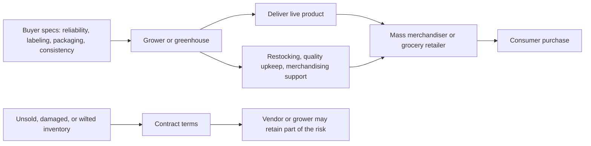
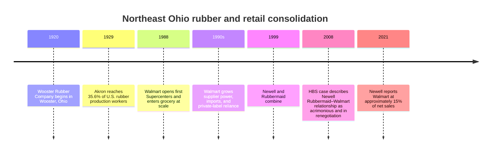

# The Rubber Made Caution Tail

The time I spent shadowing Karl Knopp gave me a clearer view of local produce than I had before. Karl has spent many years as a wholesale distributor, working with local produce and as a proud partner of Heinen's. In talking with him, I was not just hearing about produce. I was hearing about the pressures, compromises, and quiet realities that shape what local agriculture is allowed to be.

We spoke about how Ohio used to be the greenhouse capital of the world before the World Wars. That phrase — greenhouse capital — appears repeatedly in northeastern Ohio local-history and regional planning materials, particularly around Sheffield Village and the Lake Erie greenhouse corridor, though it is better understood as a regional historical self-description than as a formally benchmarked economic title.[^ohio-greenhouse-capital] That fact stayed with me. It feels almost out of place now, considering how different the landscape looks today. The greenhouses that remain are largely devoted to flowers, and even then many of them are operating in difficult economic conditions. That contrast alone says a lot. A place once known for producing life-sustaining food in controlled environments now leans heavily toward ornamental survival. What those numbers obscure, though, is that Ohio still matters in greenhouse vegetables: the USDA Economic Research Service reports that Ohio accounts for approximately 10 percent of national greenhouse tomato area, putting it second only to California in that specific category, and that U.S. greenhouse vegetable area more than doubled between 2007 and 2022 to reach 133 million square feet (USDA ERS, 2024). The shift toward flowers has not erased greenhouse food production so much as it has concentrated it, leaving a more selective and fragile structure in place.

Throughout our conversation, we spoke about growers that work with Heinen's, and how fortunate many of them are to have a buyer willing to be flexible when questions of fronting costs arise. That mattered to me because my interest was not only in local produce as an idea, but in the distribution conditions that actually determine whether local sourcing can function with some degree of equity. It is easy to praise local agriculture in the abstract. It is harder to examine the terms under which it survives. The USDA's Regional Food Hub Resource Guide captures exactly this pressure: one food hub coordinator described the position plainly — "We aim to pay farmers in 2 weeks, while many of our customers take 6 to 8 weeks to pay us, so we need to finance these receivables" — a cash-flow gap that falls hardest on smaller producers (Barham et al., 2012).

Karl noted that many greenhouses now produce flowers. My initial shock was simple: why would they not take advantage of winter demand and provide produce instead? It seemed like an obvious opening in the market. But from what Karl told me, I came to understand that the answer had less to do with demand and more to do with how risk is assigned — and with the agronomic difficulty of winter production in a climate like Ohio's. Extension research from the University of Kentucky describes greenhouse tomatoes as "the most complicated to grow" among greenhouse crops and explicitly notes that fall and winter production is "difficult to recommend" from December through mid-February, because reduced winter yields and high fuel costs generally mean lower returns for farm-scale greenhouses, even when consumer demand for fresh produce is real (Kaiser & Ernst, 2018). The market signal is there. The economics do not always follow.

In the flower business, growers can remain liable for the product unless it is sold, even when it is already in the store. In some cases, they must send their own workers to places like Home Depot, Walmart, and other large buyers just to water and maintain their own plants. If the plants wilt or die on the shop floor, that loss is still theirs to carry. I was shocked by that. I could hardly imagine how that could be profitable in the long run. As Karl described it, the burden did not end at delivery. That description fits a broader industry pattern documented in the horticultural literature, where mass-market floral channels demand extensive supplier-side services — product quality maintenance, order and delivery reliability, packaging, labeling, and merchandising support — with suppliers often retaining a share of shrink and unsold risk even after the product is on the retailer's floor (Prince, 1990). What the literature documents as a generalized pattern, Karl was describing from experience.

What I came to understand is that selling flowers is already a difficult business, and its competitiveness has forced survival through extreme efficiency. Bargaining leverage, tighter margins, larger scale, and better logistical discipline become less of an advantage and more of a minimum requirement for staying alive. It is the kind of environment where you do not merely try to improve. You grow larger or you die. Like a shark, motion itself becomes a condition of survival. The academic record on supplier concentration gives that intuition some teeth: research on Walmart's supplier relationships found that suppliers had lower gross margins than non-suppliers, and that the larger the share of a company's sales going to Walmart, the lower its margins tended to be (Mottner & Smith, 2009). Bloom and Perry's study of retailer power puts it directly: Walmart "exerted power over its suppliers and squeezed them financially" (Bloom & Perry, 2001).

That was the point in the conversation where Karl told me about Rubbermaid here in Northeast Ohio. I had heard before about the Rubbermaid parties, the women who sold the products, the scale of their reach, even their service to the United States military. It made some sense in a region shaped by Akron's identity as the rubber capital of the world, with names like Goodyear, Firestone, B.F. Goodrich, and General Tire & Rubber Company standing as industrial pillars. By 1929, Akron's factories employed 35.6 percent of all U.S. rubber production workers — a concentration of industrial identity that is difficult to fully picture today (Frank, 1961). Still, I had never really thought of Rubbermaid as a kind of fifth titan in that broader story. Rubbermaid traces its origins to the Wooster Rubber Company, founded in Wooster, Ohio in 1920, which means the company's full arc — from local rubber novelty to global housewares brand — plays out almost entirely within this regional industrial frame.

Karl went on to describe how Walmart came onto the scene and became the kind of customer companies begged to have. To serve a buyer like that meant the possibility of ever greater production, ever wider reach, and ever more confidence in future demand. Walmart opened its first grocery Supercenters in 1988 and grew to capture more than one quarter of all U.S. grocery spending by the time writers began accounting for its reach (Ruhlman, 2017). If that growth could be achieved, why not pursue even more of it? Why not build around the assumption that bigger meant safer?

But the danger was already there. There came a point when Walmart, along with many of the companies that had grown through supplying it, reached such a scale that the relationship itself changed. A buyer that large no longer needed to depend on existing producers in the same way. It could become its own provider of goods through in-house brands, foreign sourcing, and the economies of scale available only to something almost monolithic in size. Basker's survey of Walmart's economic consequences makes the structural transition plain: as Walmart grew, "its suppliers became disproportionately foreign and increasingly producing private-label goods" — a pattern that rewarded scale and standardization and slowly unmade the domestic supplier networks that had expanded to meet earlier demand (Basker, 2007). For Rubbermaid specifically, a Harvard Business School case study on the company's eventual renegotiation with Walmart identifies Walmart as Rubbermaid's largest customer and describes the relationship as having grown "acrimonious" before the two parties worked to reset it (Harvard Business School, 2008). That the problem persisted across decades is confirmed by Newell Brands' own reporting: as late as 2021, Walmart accounted for approximately 15 percent of Newell Rubbermaid's net sales — a dependency still live enough to warrant disclosure in their annual filing (Newell Brands Inc., 2021).

That transition rippled through industries. Entire operations had grown large on the assumption that the demand structure sustaining them would remain stable. In reality, they had slowly helped feed the conditions for their own displacement. That is what I take to be the cautionary tale.

To me, it speaks to the instability of obvious stability. Some forms of success look permanent right up until the moment they reveal themselves to have been transitional. Robert Shiller's *Narrative Economics* offers a frame for exactly this kind of pattern: economic stories — stories about growth, efficiency, inevitability, and scale — go viral and drive decisions, shaping industries not only through prices and contracts but through the narratives people accept as obvious (Shiller, 2020). When we think about industries, I do not know that there is any final answer to the force that drives systems toward the very conditions that may later undermine them. Whether the cost is paid in health, in community, in resilience, or in forms of value that do not immediately appear on a balance sheet, these things have a way of coming back. The action that once seemed too good to question often returns later with a tax that had simply gone uncounted.

I think that, similar to the greenhouses, there is a sad truth to be understood about capitalism. At the same time, I truly believe there is good in the world, and good in people, and I look for ways that I can help grow that good. I am not interested in controlling or destroying the bad. I do not pretend it does not matter either. It is simply part of a reality in which I can only choose the direction I face.

"There are cathedrals everywhere for those with the eyes to see."

I keep that in mind when I think about this subject. I can see the massive benefit that capitalism and globalization have provided people: the ease, the comfort, the medicine, the expanded reach of human capability. Those things are real. Because of that, I have to believe there is also some way for the unrealized economic value of the old world to be realized again, not as nostalgia, but as intentional design.

If there is anything about the future that seems to remain steadfastly true, it is that tomorrow holds both greater specialization and greater generalization. Individuals can do more and become more, while also choosing to care deeply about narrower and narrower subjects. We are increasingly afforded the ability to be intentional. That matters.

Similar to the argument I made in my agricultural market microstructure article, there is a real opportunity for local agriculture to recapture part of the market from centralized and monocrop agriculture. There are clear advantages in freshness, trust, resilience, sustainability, and community alignment. At the same time, there are limits to what a wide variety of local, healthy, and sustainable producers can afford to do in a globalized world. There will always be a place for ships carrying apples across an ocean. As long as those businesses aim to be profitable, they may have to specialize in the pure growth of apples rather than in the more satisfying harmony we associate with diversified and sustainable agriculture. There is a demand that kind of harmony cannot fully meet on its own.

The research on local food distribution supports both sides of that tension. By 2008, local food sales in the United States had reached $4.8 billion, and the majority flowed not through direct-to-consumer channels but through intermediated markets — retailers, restaurants, and regional distributors (Low et al., 2011). Local agriculture already depends on distribution structure, not just idealism. Ohio-specific research makes the same point from the ground up: regional mid-size grocery chains and independent stores are willing to buy from local farms, but distribution logistics remain the missing link, and growers who cannot meet minimum volume and consistency requirements often need technical assistance and infrastructure to "look big and 'jump' scales" (Clark, Inwood & Sharp, 2011). The framing that matters is not moral; it is operational. Pricing, delivery reliability, and the time cost of small-scale logistics remain the concrete barriers between a grower and a regional grocer, not a lack of will on either side (Thomas et al., 2024). Where buyer relationships work — as with the Heinen's distributors Karl described — it is often because trust and communication have been built deliberately over time, not assumed (Dunning, 2016). Clark and Inwood's work on scaling regional fruit and vegetable distribution points toward hybrid systems that work with existing infrastructure rather than against it — a kind of practical "piggybacking" that lets local supply move through channels that already function (Clark & Inwood, 2016).

Still, we spend our lives caring about what we care about, and that matters. If we can find ways to be intentional, then there is an added part to a greater sum. In my case, I see a vision for how local agriculture can outcompete what is worse by simply being better. And I hope someone sees the flaws in my ideas, so they might one day outcompete the evil in them that I am still unaware of.

Finally, one other note on this subject of local agriculture, hope, and flowers: Bloom Hill Farm deserves a shout out. They are a very cool operation. I recently had the pleasure of speaking with a graduate student who works on their farm, and hearing about the ingenuity involved in serving their community in a local way. Conversations like that remind me that even within difficult systems, there are still people building something careful, grounded, and alive.

That may be the real counterweight to the cautionary tale. Not the fantasy that scale, efficiency, and global reach can be undone, but the fact that human beings still have the ability to build with intention, close to home, and for reasons larger than optimization alone.

---

## References

Barham, J., Tropp, D., Enterline, K., Farbman, J., Fisk, J., & Kiraly, S. (2012). *Regional food hub resource guide*. U.S. Department of Agriculture, Agricultural Marketing Service.

Basker, E. (2007). The causes and consequences of Wal-Mart's growth. *Journal of Economic Perspectives, 21*(3), 177–198.

Bloom, P. N., & Perry, V. G. (2001). Retailer power and supplier welfare: The case of Wal-Mart. *Journal of Retailing, 77*(3), 379–396. https://doi.org/10.1016/S0022-4359(01)00048-3

Clark, J. K., & Inwood, S. M. (2016). Scaling-up regional fruit and vegetable distribution: Potential for adaptive change in the food system. *Agriculture and Human Values, 33*(3), 503–519. https://doi.org/10.1007/s10460-015-9618-7

Clark, J. K., Inwood, S. M., & Sharp, J. S. (2011). *Scaling-up connections between regional Ohio specialty crop producers and local markets: Distribution as the missing link*. The Ohio State University.

Day-Farnsworth, L., McCown, B., Miller, M., & Pfeiffer, A. (2013). *Moving food along the value chain: Innovations in regional food distribution*. U.S. Department of Agriculture, Agricultural Marketing Service.

Dunning, R. (2016). Collaboration and commitment in a regional supermarket supply chain. *Journal of Agriculture, Food Systems, and Community Development, 6*(4), 21–39. https://doi.org/10.5304/jafscd.2016.064.008

Frank, R. (1961). *The decentralization of the Akron rubber industry*. University of Akron.

Harvard Business School. (2008). *Steven Scheyer: Renegotiating the Newell Rubbermaid relationship with Wal-Mart* (Case No. 909-013). Harvard Business School Publishing.

Kaiser, C., & Ernst, M. (2018). *Greenhouse tomatoes*. University of Kentucky, Center for Crop Diversification.

Low, S. A., Adalja, A., Beaulieu, E., et al. (2011). *Direct and intermediated marketing of local foods in the United States* (ERR-128). U.S. Department of Agriculture, Economic Research Service.

Martinez, S., Christensen, L., Tropp, D., & others. (2021). *Marketing practices and financial performance of local food producers: A comparison of beginning and experienced farmers* (EIB-225). U.S. Department of Agriculture, Economic Research Service.

Mottner, S., & Smith, S. H. (2009). Wal-Mart: Supplier performance and market power. *Journal of Business Research, 62*, 535–541.

Newell Brands Inc. (2021). *Annual report on Form 10-K*. Newell Brands.

Prince, T. L. (1990). Supplier services and their importance to floral retailers in the Midwestern United States. *HortScience, 25*(3).

Ruhlman, M. (2017). *Grocery: The buying and selling of food in America*. Abrams Press.

Shiller, R. J. (2020). *Narrative economics: How stories go viral and drive major economic events*. Princeton University Press.

Thomas, A. E., et al. (2024). Exploring barriers and facilitators to direct-to-retail sales channels: Farmers' perspectives on wholesaling produce to small food retailers in Charles County, Maryland. *Journal of Agriculture, Food Systems, and Community Development, 14*(1).

U.S. Department of Agriculture, Economic Research Service. (2024). *Vegetables and pulses outlook: April 2024* (VGS-372). USDA ERS.

U.S. Department of Agriculture, National Agricultural Statistics Service. (2020). *Floriculture crops 2019 summary*. USDA NASS.

U.S. Department of Agriculture, National Agricultural Statistics Service. (2026). *2024 floriculture crops*. USDA NASS.

---

[^ohio-greenhouse-capital]: The "Greenhouse Capital of the World" or "Greenhouse Capital of America" descriptor appears in local-history and planning materials from northeastern Ohio, particularly materials associated with Sheffield Village and adjacent Lake Erie greenhouse communities. The Ohio distribution research literature also records that the regional greenhouse tomato industry later faced competitive pressure from California and Mexican imports alongside rising Ohio fuel costs. This context is documented in Clark, Inwood & Sharp (2011) and regional planning archives, though it should be understood as a historical regional self-description rather than a formally benchmarked economic designation.

---

## Aside — Supplementary Research Material

*The following material was developed as part of the research process for this essay. It is preserved here as a reference layer rather than as part of the published essay body.*

---

### Vendor liability and supplier service flow in mass-market floral retail

The diagram below synthesizes the retailer-service burden pattern documented in the floral horticultural literature. It is not a description of a single named contract. It represents the generalized logic of vendor-managed inventory and consignment-adjacent practice in mass-market floral channels, as observed across Prince (1990) and the broader retail-risk literature.

---

### Northeast Ohio rubber and retail consolidation — timeline

---

### Source comparison matrix

The table below maps the primary sources gathered for this essay to the specific claims they are best positioned to support.

| Source | Type | Strongest claim it supports |
|---|---|---|
| Ruhlman, *Grocery* (2017) | Book / reportage | Cleveland–Heinen's frame; Walmart grocery timeline and scale |
| Shiller, *Narrative Economics* (2020) | Economic theory | Why the cautionary-tale structure is itself an economic argument |
| USDA ERS, *Vegetables and Pulses Outlook* (2024) | Official | Ohio still matters in greenhouse tomatoes; national greenhouse scale doubled since 2007 |
| Kaiser & Ernst, *Greenhouse Tomatoes* (2018) | Extension | Winter greenhouse produce is labor-, light-, and fuel-intensive; difficult to recommend Dec–Feb production |
| USDA NASS, *Floriculture Crops* (2020, 2026) | Official | Flowers are a large, capital-intensive sector; Ohio in top five states nationally |
| Bloom & Perry (2001) | Peer-reviewed | Walmart exerted power over and squeezed its suppliers |
| Basker (2007) | Peer-reviewed | Walmart shifted suppliers toward imports and private labels |
| Mottner & Smith (2009) | Peer-reviewed | Walmart suppliers had lower gross margins than non-suppliers |
| HBS Newell Rubbermaid case (2008) | Academic case | Walmart was Rubbermaid's largest customer; relationship became acrimonious |
| Newell Brands Annual Report (2021) | Official filing | Walmart still ~15% of net sales in 2018–2020 |
| Frank (1961) | Academic | Akron employed 35.6% of U.S. rubber production workers in 1929 |
| USDA AMS, *Regional Food Hub Resource Guide* (2012) | Official | Payment delays of 6–8 weeks create financing pressure on local growers |
| Low et al. (2011) | Official | Local food reached $4.8B in 2008; most flows through intermediated, not direct, channels |
| Dunning (2016) | Peer-reviewed | Trust and organizational design shape grocer–farmer sourcing relationships |
| Clark & Inwood (2016) | Peer-reviewed | Local food must scale through hybrid distribution; piggybacking on existing infrastructure |
| Clark, Inwood & Sharp (2011) | Ohio research | Ohio distribution bottlenecks; "distribution as the missing link"; growers must "look big" |
| Prince (1990) | Peer-reviewed | Mass-market floral channels demand extensive post-delivery supplier services |
| Thomas et al. (2024) | Peer-reviewed | Pricing, delivery, and time costs are primary operational barriers for small growers |

---

### Research limitations and open questions

**The Karl Knopp floral liability anecdote.** The specific practice described — growers sending their own staff to water live plant inventory at named mass merchandisers, with unsold-plant liability remaining with the grower — is well-supported as a generalized pattern by the supplier-service and consignment literature but was not independently corroborated in a peer-reviewed or official source for this research set. The claim in the essay is correctly attributed to Karl Knopp's reported experience and framed against the general industry pattern rather than as a universal documented rule. If this anecdote is central to a future argument, the cleanest next evidence would be an interview transcript, a supplier agreement, or a reputable trade-press source.

**The "greenhouse capital" title.** The descriptor appears in northeastern Ohio local-history and planning materials, but it has not been verified against a benchmarked economic study. The essay treats it as regional historical memory, which is the accurate characterization based on the sources gathered.

**Bibliographic completeness.** Two of the horticultural-retail sources above are strongest as supporting literature rather than final bibliography entries because the retrieved previews did not expose every bibliographic field. Before any formal publication, verify the complete author lists and page ranges for the Prince (1990) *HortScience* article and the older mass-merchandising floriculture sources against a library database. The findings are solid; the citations need full verification.
