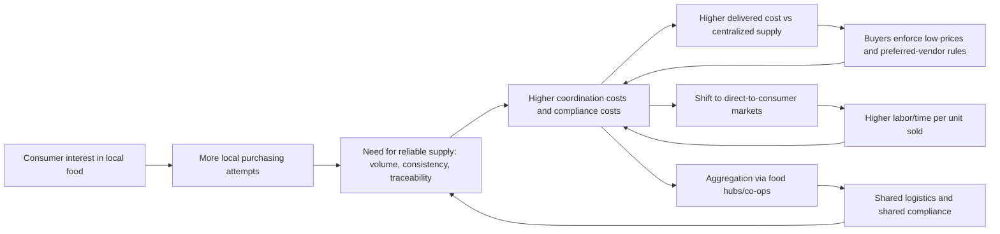

# Thirty-six Local Agriculture Economic Disadvantage Source Report

## Executive summary

Consumer interest in “local,” diverse, and healthier food is substantial, but the economics of producing and delivering food at competitive prices are dominated by logistics, marketing services, compliance, and procurement structures—areas where local producers often lack scale. Federal statistics show **$9.0B** in direct farm sales of local edible food commodities in **2020**, with **institutions and intermediaries accounting for 46%** of direct sales and **direct-to-consumer accounting for 33%**—a channel mix that highlights how “scaling local” depends heavily on meeting institutional and intermediary requirements. citeturn16view0turn16view1

At the same time, local foods remain a **small share of total agricultural activity**. ERS reporting notes local edible farm product sales totaled **$11.8B in 2017**, about **3% of all agricultural sales** in that year, illustrating that “interest” does not automatically translate into dominant market share. citeturn0search8

The structural disadvantage is reinforced by the broader food cost structure: ERS’s Food Dollar framework shows that the “food dollar” is largely absorbed by **marketing costs** (processing, transportation, labor, and selling), with the farm share a relatively small portion (e.g., **15.9 cents of each food dollar in 2023** under the Food Dollar Series marketing bill methodology). citeturn6search1turn6search5

Evidence from food hub surveys suggests aggregation helps address distribution gaps but faces tight margins and persistent constraints. The national food hub survey reports that about **two-thirds of hubs were breaking even or better**, while also identifying recurring barriers such as **meeting buyer pricing requirements**, managing **seasonality**, and **balancing supply and demand**—all central to local producers’ ability to compete in wholesale and institutional channels. citeturn18view0turn18view1turn18view2

Finally, demand-side evidence is mixed: meta-analysis and field experiments show that willingness-to-pay premiums for “local” vary substantially by product and context and may disappear under realistic market conditions—meaning price/availability constraints frequently dominate “interest.” citeturn8search7turn8search2turn11search1

## Goal and research question

**Report goal:** Compile academic and official evidence that explains why local agriculture remains economically disadvantaged despite consumer interest in local, diverse, and healthier produce. citeturn12search3turn12search2turn6search1

**Research question:** What structural economic, logistical, and institutional factors keep local agriculture economically disadvantaged relative to centralized supply chains, and which evidence-based mechanisms (e.g., aggregation, shared compliance, procurement reforms) reduce those disadvantages? citeturn12search2turn1search0turn24search0turn18view2

## Supporting sources and annotations

The list below is prioritized (core baseline evidence first). Each annotation states how the source supports a report built from compiled evidence (not personal experience).

1. **entity["organization","U.S. Department of Agriculture","federal agency us"], entity["organization","Economic Research Service","usda research agency"]. (2011). *Direct and intermediated marketing of local foods in the United States* (ERR-128).** citeturn0search0  
   Establishes how “local food” moves through direct-to-consumer and intermediated channels in nationally representative data, showing intermediated markets as a major component of local food sales. It supports the claim that scaling local sales often requires meeting the cost and reliability demands of intermediated channels. citeturn0search0

2. **entity["organization","National Agricultural Statistics Service","usda statistical agency"]. (2022). *Direct Farm Sales of Food: Highlights from the 2020 Local Food Marketing Practices Survey* (ACH17-27).** citeturn16view0turn16view1  
   Provides the clearest official snapshot of direct farm sales magnitude ($9.0B in 2020), buyer-type shares (institutions/intermediaries vs consumers), and trend direction vs 2015. It anchors the report’s baseline “market size + channel mix” claims. citeturn16view0turn16view1

3. **USDA, ERS. (2015). *Trends in U.S. local and regional food systems: A report to Congress* (AP-068).** citeturn12search2  
   Synthesizes multiple national surveys and literature to explain participation trends, marketing outlets (including food hubs), and policy context. Useful for framing why outlet growth does not automatically solve distribution or pricing barriers. citeturn12search2

4. **USDA, ERS. (2010). *Local food systems: Concepts, impacts, and issues* (ERR-97).** citeturn12search3  
   Clarifies definitional disputes (“what counts as local”) and summarizes early evidence on benefits and limitations. This supports careful scope-setting and avoids overclaiming about economic impacts without standardized measurement. citeturn12search3

5. **USDA, ERS. (2021). *Marketing practices and financial performance of local food producers: A comparison of beginning and experienced farmers* (EIB-225).** citeturn12search0  
   Links marketing strategy to financial performance using farm survey data. It supports report sections that compare economic outcomes associated with different channels and producer experience. citeturn12search0

6. **USDA, ERS. (2026). *Food Dollar* (Food Dollar Series) [data product].** citeturn6search1turn6search5  
   Quantifies how consumer food spending is divided between the farm share and marketing services, showing why competition often hinges on distribution, processing, and retail/foodservice labor costs. It strengthens the “structural cost stack” argument that local systems must overcome. citeturn6search1turn6search5

7. **entity["organization","Agricultural Marketing Service","usda marketing agency"]. (2012). *Regional Food Hub Resource Guide.* **citeturn1search0**  
   An official guide that frames food hubs as a response to missing distribution infrastructure that prevents small and midsize farms from reaching larger-volume markets. Useful as background evidence for “why aggregation matters” and what services hubs provide. citeturn1search0

8. **entity["organization","Michigan State University Center for Regional Food Systems","msu local food center"] & entity["organization","Wallace Center at Winrock International","food systems ngo us"]. (2020). *Findings of the 2019 National Food Hub Survey.* **citeturn18view0turn18view1turn18view2**  
   The strongest longitudinal evidence on food hub viability and constraints. It supports claims about margins (break-even rates), top operational challenges (balancing supply/demand), and institutional barriers (buyer pricing requirements, volume, seasonality, administrative burden). citeturn18view0turn18view1turn18view2

9. **USDA, ERS. (2018). *Estimated costs for fruit and vegetable producers to comply with the Food Safety Modernization Act’s Produce Rule* (EIB-195).** citeturn24search0  
   Provides quantified compliance costs that vary sharply by farm size (e.g., smallest farms facing much larger costs as a share of sales). This supports the report’s claim that regulatory compliance creates fixed-cost disadvantages for small/local producers. citeturn24search0

10. **entity["people","Travis Minor","ers food safety author"], et al. (2019). *Food safety requirements for produce growers: Retailer demands and the Food Safety Modernization Act* (EIB-206). USDA, ERS.** citeturn24search4  
   Shows that produce buyers/retailers often demand third-party audits beyond regulatory requirements, raising barriers and transaction costs. This is central for explaining why consumer interest does not automatically translate into buyer access for local farms. citeturn24search4

11. **entity["people","Florence A. Becot","uvm food safety cost"], et al. (2012). Costs of food safety certification on fresh produce farms in Vermont. *HortTechnology, 22*(5), 705–714.** citeturn11search2  
   Empirically documents per-acre and labor time costs associated with GAP certification, illustrating how compliance imposes ongoing fixed and administrative burdens. Useful for illustrating “regressive” compliance costs at producer level. citeturn11search2

12. **entity["people","Todd M. Schmit","cornell applied econ"], et al. (2020). Assessing the costs and returns of on-farm food safety improvements. *PLOS ONE, 15*(7), e0235507.** citeturn11search5  
   Connects food safety investments to costs and potential sales benefits, showing how returns can depend on audit status and marketing channels. Useful for a nuanced argument: compliance can enable market access, but the cost and complexity can still suppress participation for smaller farms. citeturn11search5

13. **entity["people","Iryna Printezis","local food wtp author"], et al. (2019). The price is right!? A meta-regression analysis on willingness to pay for local food. *PLOS ONE, 14*(5), e0215847.** citeturn8search7  
   Synthesizes the willingness-to-pay literature and identifies heterogeneity and publication selection bias. It supports the claim that consumer “interest” does not guarantee consistent price premiums large enough to offset structural cost disadvantages. citeturn8search7

14. **entity["people","Kelly A. Davidson","udel applied econ researcher"], et al. (2023). Are consumers no longer willing to pay more for local foods? A field experiment. *Agricultural and Resource Economics Review.* **citeturn8search2**  
   Demonstrates that a generic “locally produced” label did not increase willingness to pay for some products in a large field experiment. This supports a “demand realism” section that cautions against assuming stable premiums. citeturn8search2

15. **entity["people","Lingqiao Qi","local food barrier researcher"], et al. (2017). Buyer and nonbuyer barriers to purchasing local food. *Agricultural and Resource Economics Review.* **citeturn11search1**  
   Identifies recurring barriers—especially price and availability—that limit local food purchasing even among interested consumers. It supports arguments about market constraints beyond “preference.” citeturn11search1

16. **Jablonski, B. B. R., et al. (2016). Assessing the economic impacts of food hubs on regional economies: A framework that includes opportunity cost. *Agricultural and Resource Economics Review.* **citeturn4search6**  
   Provides an evaluation framework for measuring net and gross economic impacts of food hubs, useful for later proposal justification and for quantifying regional benefits. citeturn4search6

17. **Ge, H., et al. (2019). Embedding economies of scale concepts in the model of optimal locations of fresh produce aggregation hubs. *Agricultural and Resource Economics Review.* **citeturn4search7**  
   Uses modeling to show how economies of scale shape aggregation hub placement and performance, supporting the report’s emphasis on scale as a structural advantage for centralized systems. citeturn4search7

18. **entity["people","David A. Cleveland","us local food researcher"], et al. (2014). Local food hubs for alternative food systems: A case study from Santa Barbara County, California. *Journal of Rural Studies, 35*, 26–36.** citeturn4search1  
   A grounded case study that shows how food hubs operate as hybrids between alternative and mainstream supply chains and why success often requires tradeoffs (e.g., scaling up while maintaining values). citeturn4search1

19. **Optional technical resource (GitHub): USDA Quick Stats API client.** citeturn2search2  
   This repository supports reproducible extraction of NASS Quick Stats data for the figures suggested in the report. It is a tooling source for analysis workflow, not a primary empirical authority. citeturn2search2

20. **Optional technical resource (GitHub): USDA Market News API wrapper.** citeturn2search5  
   Useful for collecting wholesale price series to compare local delivered prices vs relevant wholesale benchmarks. Like other tooling repos, it supports data access rather than providing primary findings. citeturn2search5

### Source comparison table

| Source group | Typical type | Quality basis | Relevance | What it substantiates |
|---|---|---|---|---|
| USDA ERS reports & data products | Government research + official datasets | Methodological documentation + national coverage | High | Market size, channels, cost structure, compliance costs citeturn12search2turn6search1turn24search0 |
| USDA NASS local food survey | Government statistics | Census/survey-based reporting | High | Direct sales totals and channel breakdown citeturn16view0turn16view1 |
| Food hub survey (MSU/Wallace Center) | University/NGO sector survey | Longitudinal survey + operational metrics | High | Hub margins and institutional barriers citeturn18view0turn18view2 |
| Peer-reviewed economics papers | Academic journal articles | Peer review + empirical methods | Medium–High | WTP realism, buyer barriers, scale economics citeturn8search7turn11search1turn4search7 |
| GitHub data-access tooling | Software repositories | Code transparency + reproducibility | Medium | Enables reproducible chart building from official datasets citeturn2search2turn2search5 |

## Claims the report should make

The report’s logic should move from “market facts” to “structural mechanisms,” then to “why common solutions only partially work.”

- Local food sales are meaningful but remain a small share of the total food economy; scaling relies on intermediated channels that impose stricter requirements than direct-to-consumer outlets. citeturn16view0turn0search0turn0search8  
- The cost structure of food spending is dominated by marketing services, making logistics and distribution efficiency (often scale-driven) a key competitive advantage for centralized supply chains. citeturn6search1turn6search5  
- Direct-to-consumer channels can improve farm capture but are labor/time intensive and limited in volume; growth in the number of outlets does not guarantee scalable revenue growth without intermediated infrastructure. citeturn0search0turn12search2turn16view1  
- Food hubs and aggregators address distribution gaps, but many face tight margins and recurring constraints (balancing supply and demand, negotiating prices, and meeting buyer pricing requirements and volume needs). citeturn18view1turn18view2turn18view0  
- Compliance and buyer standards create fixed costs (FSMA Produce Rule compliance, GAP certification, third-party audits demanded by retailers) that weigh more heavily on smaller producers and can prevent entry into institutional and retail channels. citeturn24search0turn24search4turn11search2turn11search5  
- Consumer willingness-to-pay premiums for “local” is heterogeneous and sometimes absent in field settings; price and availability remain persistent barriers that can prevent consumer interest from translating into sufficient margins for producers. citeturn8search7turn8search2turn11search1  
- Perishability and buyer switching can increase revenue risk and losses for produce producers, amplifying disadvantage when storage, processing, and stable contracts are lacking. citeturn9search1turn1search0  

image_group{"layout":"carousel","aspect_ratio":"16:9","query":["USDA NASS Direct Farm Sales of Food 2020 local foods map","ERS Food Dollar farm share marketing share chart","regional food hub warehouse aggregation distribution"]}

## Suggested report structure and methods

**Suggested outline (headings + purpose):**

- **Introduction**: State the paradox (interest vs disadvantage), define “local” and scope boundaries, and set up how sources will be used as evidence. citeturn12search3  
- **Market context**: Quantify local food sales, buyer-type shares, and the role of intermediated channels (institutions/intermediaries vs direct-to-consumer). citeturn16view0turn0search8  
- **Where the money goes**: Use Food Dollar evidence to explain why distribution, processing, and selling costs dominate, and why scale economies matter. citeturn6search1turn6search5  
- **Channel constraints**: Compare direct, retail/restaurant, and institutional channels in terms of reliability, volume, pricing norms, and administrative burden. citeturn0search0turn18view2  
- **Aggregation and food hubs**: Synthesize evidence on what food hubs do, their financial viability indicators, and the barriers they report when expanding to institutions. citeturn1search0turn18view0turn18view2  
- **Compliance and buyer standards**: Compile evidence on FSMA Produce Rule costs and buyer audit demands; explain fixed-cost disadvantage for small/local producers. citeturn24search0turn24search4turn11search2  
- **Demand realism**: Summarize WTP evidence and consumer barrier evidence (price/availability) to show why demand alone cannot resolve supply-side disadvantages. citeturn8search7turn8search2turn11search1  
- **Conclusion**: Synthesize causal explanation and identify evidence-backed leverage points for a later proposal (e.g., shared services, aggregation, procurement reforms). citeturn18view2turn24search0  

## Data and visualization plan

### Data and metrics to seek

| Metric | Why it matters | Likely source(s) | Suggested visualization |
|---|---|---|---|
| Direct farm sales totals and channel shares (consumer/retail/institutions+intermediaries) | Baseline market magnitude and channel dependence | NASS local food survey highlights; Quick Stats | Stacked bars (2015 vs 2020) citeturn16view1turn14view0 |
| Local food market structure (direct vs intermediated; farm size patterns) | Explains scaling constraints and “missing middle” | ERS ERR-128; AP-068 | Channel-by-farm-size chart; summary table citeturn0search0turn12search2 |
| Farm share vs marketing share of food spending | Shows structural cost pressure beyond farm gate | ERS Food Dollar Series | Time series of farm share; cost-stack narrative graphic citeturn6search1turn6search5 |
| Food hub viability (break-even, OER, top challenges) | Tests whether aggregation solves disadvantages and where it fails | National Food Hub Survey | Histogram/box of OER; ranked barrier chart citeturn18view0turn18view1 |
| Institutional market barriers (pricing, volume, seasonality, procurement admin) | Explains why consumer interest doesn’t automatically translate into institutional buying | National Food Hub Survey; ERS trends report | “Top barriers” bar chart or heatmap by market type citeturn18view2turn12search2 |
| Food safety compliance cost as % of sales by farm size | Quantifies fixed-cost disadvantage | ERS EIB-195 | Scatter/box plot by size group citeturn24search0 |
| Retailer audit demands (third-party audits) | Shows buyer requirements beyond baseline regulation | ERS EIB-206 | Narrative + requirements matrix (retailer types) citeturn24search4 |
| Demand barriers and WTP premium variability | Prevents overclaiming “demand will fix it” | Peer-reviewed WTP evidence and barrier studies | Summary table: premium present/absent by context citeturn8search7turn8search2turn11search1 |

### Suggested causal diagram

## Limitations, bibliography, and downloads

### Methodological and scope limitations to state explicitly

- Definitions of “local” vary across studies (distance-based vs marketing-relationship-based), so the report must choose a definition and keep it consistent. citeturn12search3turn16view0  
- Farms self-select into marketing channels; differences in financial outcomes may reflect selection effects in addition to channel effects. citeturn12search0turn0search0  
- Willingness-to-pay research is method-sensitive (stated preferences vs field experiments), and premiums may not generalize across products or contexts. citeturn8search7turn8search2  
- Public datasets measure sales and outlets more consistently than transaction costs (administrative burden, negotiating time, spoilage within local distribution), requiring cautious inference and case-study support. citeturn18view1turn1search0turn9search1  

### Primary bibliography (≤30)

- USDA, ERS. (2010). *Local food systems: Concepts, impacts, and issues* (ERR-97). citeturn12search3  
- USDA, ERS. (2011). *Direct and intermediated marketing of local foods in the United States* (ERR-128). citeturn0search0  
- USDA, ERS. (2015). *Trends in U.S. local and regional food systems: A report to Congress* (AP-068). citeturn12search2  
- USDA, ERS. (2021). *Marketing practices and financial performance of local food producers* (EIB-225). citeturn12search0  
- USDA, ERS. (2026). *Food Dollar* (Food Dollar Series) [data product]. citeturn6search1turn6search5  
- USDA, NASS. (2022). *Direct Farm Sales of Food: Highlights from the 2020 Local Food Marketing Practices Survey* (ACH17-27). citeturn16view0turn16view1  
- USDA, AMS. (2012). *Regional Food Hub Resource Guide.* citeturn1search0  
- Michigan State University Center for Regional Food Systems & Wallace Center at Winrock International. (2020). *Findings of the 2019 National Food Hub Survey.* citeturn18view0turn18view2  
- USDA, ERS. (2018). *Estimated costs for fruit and vegetable producers to comply with the FSMA Produce Rule* (EIB-195). citeturn24search0  
- Minor, T., et al. (2019). *Food safety requirements for produce growers: Retailer demands and the FSMA* (EIB-206). citeturn24search4  
- Becot, F. A., et al. (2012). Costs of food safety certification on fresh produce farms in Vermont. *HortTechnology, 22*(5), 705–714. citeturn11search2  
- Schmit, T. M., et al. (2020). Costs and returns of on-farm food safety improvements. *PLOS ONE, 15*(7), e0235507. citeturn11search5  
- Printezis, I., et al. (2019). Meta-regression on WTP for local food. *PLOS ONE, 14*(5), e0215847. citeturn8search7  
- Davidson, K. A., et al. (2023). Field experiment on WTP for local label. *Agricultural and Resource Economics Review.* citeturn8search2  
- Qi, L., et al. (2017). Buyer and nonbuyer barriers to purchasing local food. *Agricultural and Resource Economics Review.* citeturn11search1  
- Jablonski, B. B. R., et al. (2016). Economic impacts of food hubs framework. *Agricultural and Resource Economics Review.* citeturn4search6  
- Ge, H., et al. (2019). Economies of scale in produce aggregation hubs. *Agricultural and Resource Economics Review.* citeturn4search7  
- Cleveland, D. A., et al. (2014). Local food hubs case study. *Journal of Rural Studies, 35*, 26–36. citeturn4search1  
- Optional data tooling: GitHub Quick Stats API client and Market News wrapper. citeturn2search2turn2search5  

### Downloads

- [Download assignment-9-instructions.md](sandbox:/mnt/data/exports/assignment-9-instructions.md)  
- [Download assignment-9-simple-plan.docx](sandbox:/mnt/data/exports/assignment-9-simple-plan.docx)  
- [Download assignment-9-simple-plan.pdf](sandbox:/mnt/data/exports/assignment-9-simple-plan.pdf)