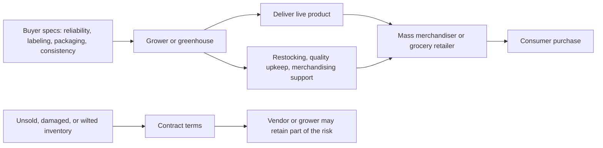
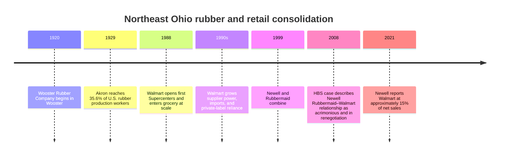

# 2 Research dossier for The Rubber Made Caution Tail

## Executive summary

The strongest support for your article comes from three different kinds of evidence that fit together well. First, the historical and agricultural record supports the idea that northeastern Ohio had a major greenhouse identity, especially around tomatoes, while current USDA data show that Ohio still matters in greenhouse vegetables even as floriculture remains a large and highly professionalized industry. Second, the retail and supply-chain literature supports your larger cautionary arc: large retailers create powerful incentives toward scale, standardization, and risk transfer, which can squeeze growers and suppliers even when consumer demand appears strong. Third, the local-food and value-chain literature gives you a credible way to pivot from critique to hope, because it shows that local and regional supply chains can work when they solve coordination, trust, aggregation, and cash-flow problems rather than simply appealing to sentiment. citeturn37view1turn37view0turn39view2turn29view1turn29view3turn31view1

The two books you asked to prioritize are useful in different ways. Michael Ruhlman’s *Grocery* is not a scholarly monograph, but it is highly usable for your voice because it is built around Cleveland, Heinen’s, supermarket history, and the shift toward Walmart-scale grocery power. Robert J. Shiller’s *Narrative Economics* is the best conceptual companion: it gives you a rigorous way to frame your essay not just as memoir or opinion, but as an argument about how growth stories, thrift stories, and “evil business” stories shape economic action. citeturn6view0turn7view0

One claim in your draft is only partially supported by the evidence I gathered: the exact anecdote that greenhouse/floral growers remain liable for unsold plants on big-box floors and must send their own staff to water inventory at retailers such as Home Depot or Walmart. The literature I found strongly supports adjacent facts—mass-market floral retail requires extensive supplier services, quality maintenance, delivery reliability, packaging, labeling, and marketing support, and consignment/VMI contracts commonly leave ownership risk with the vendor—but I did not retrieve a peer-reviewed or official source in this set that documents that exact chain-specific practice. I would therefore use that passage as Karl Knopp’s reported experience unless you can corroborate it with an interview transcript, trade-contract language, or a trade-press source. citeturn14view0turn13search0turn13search12

## Priority books

The most useful sections of Michael Ruhlman’s *Grocery: The Buying and Selling of Food in America* are the ones that sit closest to your Cleveland–Heinen’s–distribution frame. The table of contents identifies **“The Visionary Cleveland Grocer and the One-Stop Shop”** (starts p. 47), **“Thirty-Two Thousand Pounds of Carrots, Every Week”** (starts p. 205), and **“The Cleveland Trust”** (starts p. 273) as especially relevant, while the previewed opening chapter is directly useful for Walmart’s rise. Ruhlman’s value for your article is not statistical proof; it is that he gives you a language for grocery power, supermarket scale, and the moral ambivalence of abundance without flattening everything into jargon. Quotable preview lines include “grocery stores were the land of opportunity” and “Walmart alone took more than one quarter of all the dollars we spent on groceries.” The preview also makes explicit that Heinen’s is the narrative anchor of the book. citeturn6view0

**APA citation:** Ruhlman, M. (2017). *Grocery: The buying and selling of food in America*. Abrams Press. Preview URL: Barnes & Noble book page.  
**Use in your article:** Best for the opening and middle sections where you move from your own observation into grocery history, buyer power, and the peculiar scale of the modern supermarket.  
**Short annotated excerpts:**  
“grocery stores were the land of opportunity.” This line supports your more reflective passages about abundance, possibility, and the seduction of scale. It also helps you keep a human tone while discussing systems.  
“Walmart alone took more than one quarter of all the dollars we spent on groceries.” This is the cleanest bridge from the older regional grocery world to the new scale of national retail power. citeturn6view0

The most useful sections of Robert J. Shiller’s *Narrative Economics: How Stories Go Viral and Drive Major Economic Events* are **“Why Do Some Narratives Go Viral?”** (p. 31), **“Seven Propositions of Narrative Economics”** (p. 87), **“Perennial Economic Narratives”** (p. 105), **“Frugality versus Conspicuous Consumption”** (p. 136), and **“Boycotts, Profiteers and Evil Business”** (p. 239). Shiller is the right book for the larger philosophical move you are trying to make near the end of the draft: that industries run on stories of efficiency, growth, inevitability, and value, and those stories often outlive the conditions that made them seem true. The cleanest quotable lines available from the accessible preview text are “ideas can go viral and move markets” and “stories … drive the economy by driving our decisions.” citeturn7view0

**APA citation:** Shiller, R. J. (2020). *Narrative economics: How stories go viral and drive major economic events*. Princeton University Press. URL: Google Books preview.  
**Use in your article:** Best for the essay’s title logic, your “cautionary tale” framing, and your later paragraphs on capitalism, hope, and how apparently stable systems reproduce their own instability.  
**Short annotated excerpts:**  
“ideas can go viral and move markets.” This gives you a concise scholarly frame for discussing why both the greenhouse story and the Rubbermaid/Walmart story matter beyond their facts.  
“stories … drive the economy by driving our decisions.” This line supports your claim that what looks like neutral economic logic is often narrative logic in disguise. citeturn7view0

## Greenhouses, floriculture, and Ohio

For the factual backbone of your greenhouse section, the most useful official source is the USDA Economic Research Service’s 2024 greenhouse snapshot. It reports that U.S. greenhouse vegetable area reached **133 million square feet** in 2022, that this area had **more than doubled since 2007**, that **Ohio accounted for 7 percent** of total greenhouse vegetable area, and that **Ohio accounted for 10 percent of greenhouse tomato area**, behind only California in one measure. This is important because it lets you avoid an overstatement like “Ohio greenhouses are gone” while still showing that the present structure is highly selective and constrained. Two clean quotes are “Greenhouse vegetable area totaled 133 million square feet” and “Ohio (10 percent)” for greenhouse tomato area. citeturn37view1

**APA citation:** U.S. Department of Agriculture, Economic Research Service. (2024). *Vegetables and pulses outlook: April 2024* (VGS-372). URL: USDA ERS PDF.  
**Use in your article:** Best after the sentence where you ask why winter greenhouse produce did not expand more aggressively in Ohio. It shows that greenhouse vegetables exist and even matter in Ohio, while making clear that scale remains concentrated.  
**Short annotated excerpts:**  
“Greenhouse vegetable area totaled 133 million square feet.” Good for grounding the discussion in actual scale rather than nostalgia.  
“Greenhouse tomatoes comprised over half of greenhouse vegetable area.” Good for showing that tomato production remains a central greenhouse category, even if not always locally dominant in every region. citeturn37view1

If you want one source that directly answers your draft’s question—why not simply grow produce in winter greenhouses?—use the University of Kentucky extension profile on greenhouse tomatoes. It states that tomatoes are “the most complicated to grow” among greenhouse crops because they require the most management, labor, and light, and it adds that for smaller farm greenhouses, **fall and winter production generally results in lower returns because of reduced yields and high fuel costs**. Two especially usable lines are “the most complicated to grow” and “difficult to recommend” production from December through mid-February. This source gives you a sober economic explanation for why winter produce is not an obvious arbitrage opportunity. citeturn37view0

**APA citation:** Kaiser, C., & Ernst, M. (2018). *Greenhouse tomatoes*. University of Kentucky, Center for Crop Diversification. URL: University of Kentucky PDF.  
**Use in your article:** Best immediately after your sentence expressing shock that greenhouses did not pivot harder into winter produce.  
**Short annotated excerpts:**  
“the most complicated to grow.” This is a compact rebuttal to the intuition that winter greenhouse vegetables are straightforward.  
“difficult to recommend” December–mid-February harvest schedules. This line directly supports the economic difficulty of winter production in climates like Ohio’s. citeturn37view0

For the flower side of the story, USDA NASS gives you the highest-confidence official context. The 2019 floriculture summary reports a U.S. wholesale floriculture value of **$4.42 billion**, with **Ohio among the top five states**, and the 2024 highlights report **969 million square feet** of covered area used for floriculture production nationwide. These two reports help you show that flowers are not a hobby niche; they are a large, capital-intensive sector, which makes the industry’s low margins and service burdens more believable. A concise quote from the 2019 summary is that New Jersey and “Ohio round out the top 5,” while the 2024 highlight gives the clean scale figure on covered area. citeturn39view2turn39view0

**APA citation:** U.S. Department of Agriculture, National Agricultural Statistics Service. (2020). *Floriculture crops 2019 summary*. URL: USDA NASS PDF.  
**APA citation:** U.S. Department of Agriculture, National Agricultural Statistics Service. (2026). *2024 floriculture crops*. URL: USDA NASS highlights PDF.  
**Use in your article:** Best when you pivot from the memory of greenhouse tomatoes to the contemporary dominance of flowers and bedding plants.  
**Short annotated excerpts:**  
“Ohio round out the top 5.” This helps you present Ohio as still materially present in floriculture rather than merely postindustrial.  
“Covered area used for production was 969 million square feet.” This makes the flower economy legible as infrastructure, not ornament. citeturn39view2turn39view0

For your claim that parts of northeastern Ohio were once known as a greenhouse capital, the evidence is real but more local-historical than peer-reviewed. Local historical publications from Sheffield Village and related regional planning materials repeat that northeastern Ohio was described as the “Greenhouse Capital of the World” or at least the “Greenhouse Capital of America,” and one local history also records that the area’s greenhouse tomato business was later pressured by imports from Mexico and California along with Ohio heating costs. These are worth using for color and place, but I would present them as regional historical memory rather than as a formally adjudicated title. citeturn12search6turn12search5

For the retail-practice side of floriculture, the strongest scholarly source I retrieved is a 1990 *HortScience* article on supplier services to floral retailers and mass marketers. It found that retailers ranked **product quality maintenance, order/delivery reliability, product availability, response to problems, and personnel courtesy** as the most important supplier services, and that mass marketers rated packaging, labeling, and communications/order information more highly than traditional florists. This does not prove the exact Karl Knopp anecdote about in-store watering and unsold liability, but it strongly supports the broader point that in floral channels, suppliers are often expected to do much more than merely drop off product. citeturn14view0

**APA citation:** Prince, T. L. (1990). *Supplier services and their importance to floral retailers in the Midwestern United States*. *HortScience*, 25(3). URL: ASHS PDF.  
**Use in your article:** Best in the paragraph where you describe your surprise at how much post-delivery burden still sits with growers.  
**Short annotated excerpts:**  
“product quality maintenance” was rated as the top supplier service.  
Mass marketers placed greater importance on “product marketing, packaging, labeling, and communication/order information services.” citeturn14view0

The flow of liability in your flower paragraph is best framed as a generalized retail-risk model rather than a single universal rule. The figure below synthesizes what the floriculture service literature, mass-market retail literature, and consignment/VMI logic all suggest: the retailer provides access to traffic, but the grower or vendor often remains responsible for quality performance, shelf-readiness, and some share of shrink risk. citeturn14view0turn13search0turn13search12

## Walmart, Rubbermaid, and supplier power

Your Walmart–Rubbermaid section is one of the best-supported parts of the essay. Ruhlman’s preview gives a vivid, readable bridge into the topic by noting that Walmart entered grocery through its first Supercenters in **1988** and had become the largest grocery seller by the time he was writing, while Elizabeth Basker’s survey article makes the deeper academic point: Walmart’s suppliers became “disproportionately foreign” and increasingly oriented toward **private-label goods**. Together, these sources support your core argument that scale first rewards growth and later alters the structure of production itself. citeturn6view0turn17search2

**APA citation:** Basker, E. (2007). The causes and consequences of Wal-Mart’s growth. *Journal of Economic Perspectives, 21*(3), 177–198. URL: NYU archive PDF.  
**Use in your article:** Best for the claim that retailers like Walmart changed not only prices but supplier geography, ownership, and sourcing logic.  
**Short annotated excerpts:**  
“suppliers are disproportionately foreign and increasingly producing private-label goods.” This is the sharpest one-line support for your offshoring paragraph.  
“Wal-Mart was not always a major importer.” This helps you emphasize transition rather than inevitability. citeturn17search2

The canonical academic article on Walmart’s bargaining power is Bloom and Perry’s *Retailer power and supplier welfare: The case of Wal-Mart*. Its abstract states plainly that the paper examines whether Walmart “exerted power over its suppliers and squeezed them financially.” That maps directly onto your draft’s concern that growth can become self-destroying when a dominant buyer eventually captures the value it once helped create. citeturn19search2turn20search13

**APA citation:** Bloom, P. N., & Perry, V. G. (2001). Retailer power and supplier welfare: The case of Wal-Mart. *Journal of Retailing, 77*(3), 379–396. https://doi.org/10.1016/S0022-4359(01)00048-3  
**Use in your article:** Best for the sentence where you argue that Walmart’s growth changed the terms of life for companies like Rubbermaid.  
**Short annotated excerpts:**  
“exerted power over its suppliers.”  
“squeezed them financially.” citeturn19search2turn20search13

A useful companion to that article is Mottner and Smith’s research on supplier performance and market power. The result snippet available from the article reports that Walmart suppliers had **lower gross margins than non-suppliers**, and that those with a larger share of sales to Walmart had lower margins still. This is exactly the kind of evidence that helps your essay move from mood to mechanism. citeturn20search15

**APA citation:** Mottner, S., & Smith, S. H. (2009). Wal-Mart: Supplier performance and market power. *Journal of Business Research, 62*, 535–541. URL: previewed copy.  
**Use in your article:** Best for the line where you describe the competitive environment as shark-like: keep getting larger or die.  
**Short annotated excerpts:**  
“lower gross margins than non-suppliers.”  
“suppliers with a larger percentage of sales to Wal-Mart have lower gross margins.” citeturn20search15

For Rubbermaid specifically, the cleanest direct source is the Harvard Business School case **“Steven Scheyer: Renegotiating the Newell Rubbermaid Relationship with Wal-Mart,”** which identifies Walmart as **Rubbermaid’s largest customer** and describes the relationship as having grown “acrimonious” before renegotiation. That is the best single source to justify keeping Rubbermaid in the essay not just as an industrial icon, but as a company whose fate was materially entangled with a dominant retailer. A second, later official corroboration comes from Newell’s 2021 annual report, which states that Walmart still accounted for about **15 percent of net sales** in 2018–2020. The cautionary structure of your paragraph is therefore historically grounded: concentration in one enormous buyer remained a live issue long after the original Rubbermaid story. citeturn21search1turn25search20

**APA citation:** Harvard Business School. (2008). *Steven Scheyer: Renegotiating the Newell Rubbermaid relationship with Wal-Mart* (Case No. 909-013). URL: HBS case page.  
**APA citation:** Newell Brands Inc. (2021). *Annual report on Form 10-K*. URL: annual report PDF.  
**Use in your article:** Best where you move from the broader Walmart story to Rubbermaid as the emblematic local caution.  
**Short annotated excerpts:**  
“Rubbermaid’s largest customer.”  
“accounted for approximately 15% of net sales.” citeturn21search1turn25search20

For the Northeast Ohio industrial backdrop, two sources are especially useful. Richard Frank’s 1961 study on the decentralization of the Akron rubber industry reports that Akron factories employed **35.6 percent of all U.S. rubber production workers in 1929**, which gives you a strong measure of just how central Akron once was. Brookings’ 2008 Akron economic profile adds a broader regional frame by tracing the rise of rubber from the late nineteenth century through much of the twentieth. If you want a local-history source on Rubbermaid’s origins in Wooster, the Wooster History Center’s exhibit on “Eight Decades of Rubbermaid in Wooster” is solid for context, though I would treat it as historical scaffolding rather than your primary analytical evidence. citeturn22search4turn22search11turn25search0

The timeline below condenses the strongest historical moments for your “cautionary tale” structure: industrial concentration, retailer expansion, supplier dependence, and post-merger renegotiation. citeturn22search4turn6view0turn17search2turn21search1turn25search20

## Local produce distribution, equity, and market structure

The local-food literature is especially helpful because it supports the last third of your essay without collapsing into naïve “local good, global bad” rhetoric. USDA ERS showed in 2011 that local-food sales through **intermediated channels**—retailers, restaurants, and regional distributors—were larger than direct-to-consumer channels, and that small farms dominated the count while medium farms were especially likely to mix direct and intermediated channels. In other words, local agriculture already depends on distribution structure, not just idealism. Two useful lines are that local-food marketing in 2008 grossed **$4.8 billion** and that farms selling exclusively through intermediated channels reported **$2.7 billion** in local-food sales. citeturn29view1

**APA citation:** Low, S. A., Adalja, A., Beaulieu, E., et al. (2011). *Direct and intermediated marketing of local foods in the United States* (ERR-128). U.S. Department of Agriculture, Economic Research Service. URL: USDA ERS PDF.  
**Use in your article:** Best when you argue that recapturing market share for local agriculture will require working through retail and distribution channels, not only through farm stands or idealized direct sales.  
**Short annotated excerpts:**  
“grossed $4.8 billion in 2008.”  
“$2.7 billion in local food sales” through intermediated channels. citeturn29view1

The 2021 USDA ERS report on beginning versus experienced local-food producers pushes that point further. It reports that in 2015, **most growth was from intermediated markets rather than direct-to-consumer sales**, and it explicitly notes sales directly to **supermarkets or supercenters**. This is an excellent source for your middle and final sections because it lets you discuss local markets as a question of market design, channel access, and margin, not just ethics. citeturn29view2

**APA citation:** Martinez, S., Christensen, L., Tropp, D., & others. (2021). *Marketing practices and financial performance of local food producers: A comparison of beginning and experienced farmers* (EIB-225). U.S. Department of Agriculture, Economic Research Service. URL: USDA ERS PDF.  
**Use in your article:** Best when you discuss whether local agriculture can compete in a globalized world by being better rather than merely smaller.  
**Short annotated excerpts:**  
“most of the growth was from intermediated markets.”  
“supermarkets or supercenters (e.g., Walmart, Kroger, Whole Foods Market).” citeturn29view2

For the question of fronting costs and buyer flexibility, the USDA Regional Food Hub Resource Guide is one of the most directly useful official sources. On cash flow, it includes the line: **“We aim to pay farmers in 2 weeks, while many of our customers take 6 to 8 weeks to pay us, so we need to finance these receivables.”** That is almost exactly the problem your draft is circling when it mentions a buyer flexible on fronting costs. The guide also stresses that inadequate capital access affects growers’ ability to produce larger volumes of high-quality products. citeturn29view3

**APA citation:** Barham, J., Tropp, D., Enterline, K., Farbman, J., Fisk, J., & Kiraly, S. (2012). *Regional food hub resource guide*. U.S. Department of Agriculture, Agricultural Marketing Service. URL: USDA AMS PDF.  
**Use in your article:** Best for the passage about growers being “lucky to have a buyer that is so flexible” around fronted costs and risk.  
**Short annotated excerpts:**  
“We aim to pay farmers in 2 weeks.”  
“many of our customers take 6 to 8 weeks to pay us.” citeturn29view3

Another USDA AMS report, *Moving Food Along the Value Chain*, helps with your equity language because it frames local/regional systems not only as logistics but as negotiated business relationships. It states that key business practices include managing infrastructure to transform, pack, and transport products and **“negotiating with buyers to secure a fair return for the producers.”** That phrase gives you a precise, non-sentimental way to talk about equity in sourcing. citeturn31view0

**APA citation:** Day-Farnsworth, L., McCown, B., Miller, M., & Pfeiffer, A. (2013). *Moving food along the value chain: Innovations in regional food distribution*. U.S. Department of Agriculture, Agricultural Marketing Service. URL: USDA AMS PDF.  
**Use in your article:** Best near the end, when you move from criticism of abstraction and scale toward a constructive account of better local systems.  
**Short annotated excerpts:**  
“secure a fair return for the producers.”  
“managing infrastructure to transform, pack, and transport farm products.” citeturn31view0

Rebecca Dunning’s study of a regional supermarket chain is the best peer-reviewed source for your Heinen’s-type buyer relationship question. It finds that trust, communication, and positive prior exchanges matter, but that chain-level purchasing structures and farm-level supply variability can block collaborative sourcing even when everyone wants it to work. The most useful line for your draft is that growers can be supported to become **“preferred vendors”** for regional grocery chains. This supports your intuition that the right buyer relationship can make the difference between possibility and impossibility. citeturn31view1

**APA citation:** Dunning, R. (2016). Collaboration and commitment in a regional supermarket supply chain. *Journal of Agriculture, Food Systems, and Community Development, 6*(4), 21–39. https://doi.org/10.5304/jafscd.2016.064.008  
**Use in your article:** Best where you describe the importance of a flexible buyer and the present-day realities of local produce sourcing.  
**Short annotated excerpts:**  
“preferred vendors” for regional grocery chains.  
“organizational structures constraining single-store autonomy in purchasing and pricing.” citeturn31view1

Clark and Inwood’s article on scaling up regional fruit and vegetable distribution is especially helpful for the final, aspirational third of your essay because it acknowledges both the **limits of direct marketing** and the possibility of hybrid systems that “piggyback” on existing infrastructure. It also begins from an Ohio policy question, which makes it unusually close to your article’s geography and spirit. This is a strong source for arguing that local agriculture can be more intentional and more structurally competent, not just more morally pleasing. citeturn35view2

**APA citation:** Clark, J. K., & Inwood, S. M. (2016). Scaling-up regional fruit and vegetable distribution: Potential for adaptive change in the food system. *Agriculture and Human Values, 33*(3), 503–519. https://doi.org/10.1007/s10460-015-9618-7  
**Use in your article:** Best for the paragraphs where you talk about specialization, intentionality, and local agriculture competing by being better.  
**Short annotated excerpts:**  
“limits of direct marketing.”  
“piggybacking” as a way of scaling-up local food systems. citeturn35view2

Finally, the Ohio-specific report by Clark, Inwood, and Sharp may be the single best bridge between your own observations and policy-relevant research. It reports that regional mid-size chains and independent groceries in Ohio are willing to buy from local small and medium farms, that many Ohio retailers actually prefer using distributors rather than buying directly from farmers, and that trust-building between distributors and producers is central to expanding Ohio-grown produce. It also bluntly notes that if growers cannot scale because of time or capital constraints, technical assistance and infrastructure may allow them to “look big and ‘jump’ scales.” citeturn34view0

**APA citation:** Clark, J. K., Inwood, S. M., & Sharp, J. S. (2011). *Scaling-up connections between regional Ohio specialty crop producers and local markets: Distribution as the missing link*. The Ohio State University. URL: report PDF.  
**Use in your article:** Best for the specific Ohio passages on distribution considerations, equity, and why local sourcing often succeeds or fails at the middle layers.  
**Short annotated excerpts:**  
“Distribution as the missing link.”  
“look big and ‘jump’ scales.” citeturn34view0

A newer peer-reviewed companion is the 2024 article on farmers’ perspectives on wholesaling produce to small retailers. It reports that pricing, seasonality, and the time cost of making small deliveries are major barriers, and that many retailers source through large distributors because of convenience and lower price points. This source is useful when you want to show that the friction in local produce is not ideological; it is operational. citeturn35view0

**APA citation:** Thomas, A. E., et al. (2024). Exploring barriers and facilitators to direct-to-retail sales channels: Farmers’ perspectives on wholesaling produce to small food retailers in Charles County, Maryland. *Journal of Agriculture, Food Systems, and Community Development, 14*(1). URL: article PDF.  
**Use in your article:** Best as a support note to your paragraph on present-day distribution considerations and why small growers cannot simply plug into retail.  
**Short annotated excerpts:**  
“pricing” was the most cited barrier.  
“diverting time away from the farm to deliver relatively small quantities.” citeturn35view0

## Comparison matrix and draft placement guide

The table below is a fast way to choose sources depending on what sentence or paragraph you want to strengthen.

| Source | Type | Relevance | Credibility | Strongest claim it supports |
|---|---|---:|---:|---|
| Ruhlman, *Grocery* | Book / reportage | High | Medium | Cleveland–Heinen’s frame; Walmart grocery consolidation |
| Shiller, *Narrative Economics* | Book / economic theory | High | High | Why “cautionary tale” is itself an economic argument |
| USDA ERS, *Vegetables and Pulses Outlook* | Official | High | High | Ohio still matters in greenhouse tomatoes; national greenhouse scale |
| Kaiser & Ernst, *Greenhouse Tomatoes* | Extension / official academic | High | High | Winter greenhouse produce is labor-, light-, and fuel-intensive |
| USDA NASS, *Floriculture Crops* | Official | High | High | Flowers are a large, concentrated, capital-intensive industry |
| Bloom & Perry (2001) | Peer-reviewed | High | High | Walmart squeezed suppliers through retailer power |
| Basker (2007) | Peer-reviewed | High | High | Walmart shifted suppliers toward imports and private labels |
| HBS Newell Rubbermaid case | Academic case | High | High | Walmart was central to Rubbermaid/Newell buyer concentration |
| USDA AMS, *Regional Food Hub Resource Guide* | Official | High | High | Buyer payment delays create financing pressure on local growers |
| Dunning (2016) | Peer-reviewed | High | High | Trust and organizational design shape grocer–farmer sourcing |
| Clark & Inwood (2016) | Peer-reviewed | High | High | Local food must scale through hybrid distribution systems |
| Clark, Inwood, & Sharp (2011) | Ohio research report | Very high | Medium-high | Ohio distribution bottlenecks and willingness of regional grocers |

The most efficient citation placements in your current draft are these. After **“Ohio used to be the greenhouse capital of the world”**, add a cautious citation cluster that marks it as regional historical language rather than uncontested fact: use the local-history sources plus the Ohio distribution report. citeturn12search6turn12search5turn34view0

After **“now a days the only green houses are massively devoted to flowers”**, insert USDA NASS and USDA ERS sources. These do not prove “only,” but they do support a stronger revision such as “many surviving greenhouse operations are now concentrated in floriculture and bedding plants, even though Ohio still remains significant in greenhouse vegetables.” citeturn39view2turn39view0turn37view1

After **“why they did not take advantage of a market demand during the winter to provide grown produce”**, use the greenhouse tomato extension source. It directly explains why winter production is not simply a missed opportunity. citeturn37view0

After the paragraph on **growers carrying costs and tending plants in stores**, use the floral service source and, if you keep the liability language, explicitly attribute the most specific claim to Karl Knopp rather than to the literature. A good pattern is: “As Karl described it, the burden did not end at delivery. That description fits a broader industry pattern in which mass-market floral channels demand supplier-side quality maintenance, packaging, labeling, and problem response.” citeturn14view0turn13search0turn13search12

After **“Like a shark, just keep growing larger or die”**, cluster the Walmart power sources. This is where Bloom and Perry, Mottner and Smith, and Basker fit best. citeturn19search2turn20search15turn17search2

After **“walmart came on to the scene”** and **“they could be their own provider of goods”**, cite Ruhlman for the grocery timeline and Basker for foreign suppliers/private labels. citeturn6view0turn17search2

After **“this is the part of the conversation that Karl told me about the rubber made company here in north east ohio”**, use the Akron rubber history and HBS/Newell-Rubbermaid sources. That gives the paragraph a stronger hinge between regional industrial memory and the retail-transition caution. citeturn22search4turn22search11turn21search1turn25search20

After the last third of the essay beginning around **“there is a sad truth to be understood about capitalism”** and continuing through your argument about intentional local agriculture, use Shiller for the narrative frame and the local-food supply-chain sources for the constructive side of the argument. citeturn7view0turn31view0turn31view1turn35view2turn34view0

If you want one sentence to attach to the Bloom Hills Farm mention, the best support in this research set is indirect rather than farm-specific: sources on food hubs, regional grocery relationships, and scaling up Ohio specialty-crop distribution support the broader claim that ingenuity in aggregation, distribution, and community-facing logistics is where local systems become durable. citeturn29view3turn31view1turn34view0

## Open questions and limitations

The exact contract structure behind Karl Knopp’s story about floral liability remains the main unresolved point. The sources gathered here strongly support vendor-side service burdens and the logic of consign­ment/VMI-type risk transfer, but I did not retrieve a peer-reviewed or official source directly describing growers sending their own workers to water live plant inventory at named mass merchants or documenting uniform contractual liability for all unsold/wilted product. If that anecdote is central, the cleanest next evidence would be an interview transcript, a supplier agreement, or a reputable trade source. citeturn14view0turn13search12

The phrase that Ohio or northeastern Ohio was the “Greenhouse Capital of the World” is documented in local-history and planning materials, but I would still treat it as a historical regional descriptor rather than a benchmarked economic title. The safer academic move is to write that parts of northeastern Ohio were widely described that way in local historical memory and that greenhouse tomatoes were once a major regional specialty. citeturn12search6turn12search5

Two of the horticulture-retail sources above are strongest as supporting literature rather than as final bibliography items because the retrieved previews did not expose every bibliographic field. Before publication, verify the complete author lists and page ranges for the *HortScience* and older mass-merchandising floriculture articles in a library database. The findings themselves are strong enough to guide the article, but your finished bibliography should be cleaned against the full journal records. citeturn14view0turn13search0turn15search1