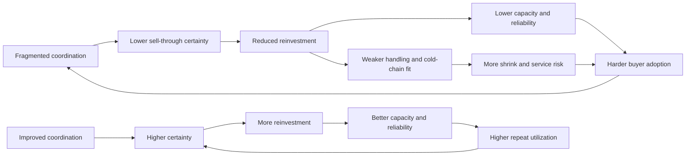
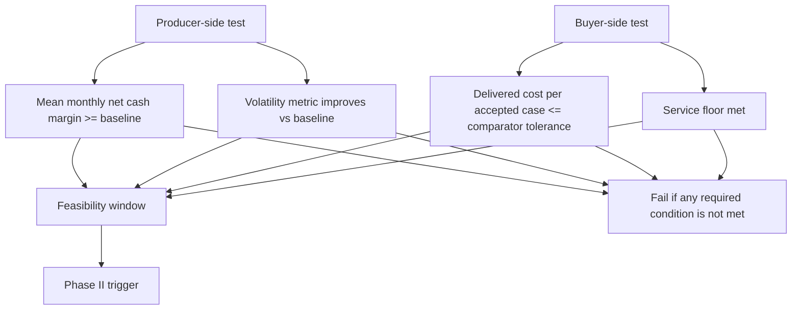

# 1 Proposal Deep Research Report

## Executive Summary

The strongest reading of the draft is not “a platform proposal” and not “a general local-food advocacy document.” It is a bounded Phase I feasibility proposal whose governing question is whether better coordination can create at least one scenario in which farms are not worse off and buyers are not worse off. The repo already contains that logic in the near-final narrative, the agronomic micro-structure article, and the feasibility-window snippets. The course materials in the repo reinforce the same standard: a proposal needs a clear purpose, a usable information plan, a realistic work sequence, and explicit decision utility for the reader. fileciteturn38file0L1-L1 fileciteturn39file0L1-L1 fileciteturn42file0L1-L1 fileciteturn44file0L1-L1 fileciteturn22file0L1-L1 fileciteturn23file0L1-L1

The public evidence base is strong enough to support the body of that proposal without turning it into a full literature review. The clearest national anchor is local-food market structure: the 2020 Local Food Marketing Practices Survey found $9.0 billion in direct farm sales of local edible food, with intermediaries and institutions accounting for 46 percent of sales and direct-to-consumer channels accounting for 33 percent. That means any scalable local-food proposal has to clear institutional and intermediary requirements, not just consumer preference. citeturn9search38turn9search8

The deeper economic constraint is the post-farm cost stack. In the current entity["organization","U.S. Department of Agriculture","federal agency us"] entity["organization","Economic Research Service","usda research agency"] Food Dollar materials, most consumer food spending goes to marketing activities rather than farm production; in 2023, farmers received 15.9 cents of each dollar spent on domestically produced food, and the remaining share went to transporting, processing, wholesaling, retailing, and related functions. That is exactly the structural terrain your proposal is trying to test, and it supports keeping the problem statement focused on coordination, logistics, and administrative friction rather than on demand alone. citeturn4search0turn4search1turn4search5

The best operational evidence for coordination failure comes from the food-hub literature and sector surveys. The 2019 National Food Hub Survey reported two persistent findings that matter directly to this proposal: balancing supply and demand remained the top challenge, and meeting buyer pricing requirements was the largest barrier to expanding institutional sales. The 2021 survey sharpened that institutional picture by reporting that school-food-service barriers centered on delivery capacity, competitive price points, processing capacity, packaging format, and procurement navigation. The 2025 survey continued the same pattern, with many hubs reporting difficulty negotiating prices, accessing capital, improving infrastructure, and handling trucking/logistics. citeturn5search1turn10search33turn10search32

Perishability is not a side issue in this proposal; it is one of the core mechanisms that makes coordination economically consequential. ERS’s loss-adjusted food-availability documentation reports 2010 total losses of 37 percent for fresh fruit and 34 percent for fresh vegetables at retail and consumer levels, excluding farm-level loss. Separate field-measurement studies in North Carolina found much larger unutilized amounts at the farm gate in sampled vegetable systems, including average unutilized produce equal to 42 percent of marketed yield in one multi-farm study. Those numbers do not prove the same rates in entity["place","Summit County","Ohio, US"], but they do justify a Phase I design that explicitly models shrink, timing windows, acceptance criteria, and harvest/use mismatch. citeturn5search3turn12search0turn12search5

The “two-sided feasibility window” is not a standard term in the public literature. It is a proposal-native synthesis. But it is a defensible one. Your repo materials define it clearly, and the literature supports its two halves: producer viability cannot be assumed under unstable sell-through and compliance costs, and buyer adoption cannot be assumed if price, service, and procurement thresholds are missed. The right decision rule for Phase I is therefore: advance only if at least one source-grounded scenario satisfies both sides at once. fileciteturn42file0L1-L1 fileciteturn43file0L1-L1 fileciteturn46file0L1-L1 citeturn7search0turn7search1turn5search2turn10search5

## Files Extracted and Analyzed

The highest-value repo files for this pass were these:

- `textbook/ch.17.txt` for proposal form, persuasive purpose, and proposal-reader expectations. fileciteturn20file0L1-L1
- `textbook/ch.16.txt` for planning-report logic, work-plan realism, and reader-facing decision structure. fileciteturn22file0L1-L1
- `textbook/ch.3.txt` for usability, audience, purpose, task analysis, timing, and information planning. fileciteturn23file0L1-L1
- `modules/work-mod_3-teacher_note.txt` for concise definition/description/summary expectations relevant to the abstract, problem statement, and figure captions. fileciteturn30file0L1-L1
- `anthology/proposal/v0.4-proposal-near-final.md` for the current body, technical objectives, eight-month sequence, and Phase II trigger logic. fileciteturn38file0L1-L1
- `anthology/articles/agronomic_mirco_structure.md` for the coordination-failure loop, reinvestment cycle, and “critical point” framing. fileciteturn39file0L1-L1
- `anthology/SBIR/proposal_outline.md` for the section map, expected proposal parts, and SBIR-facing requirements. fileciteturn41file0L1-L1
- `anthology/SBIR/sbir_research_notes.txt` for operational notes on qualifications, budget logic, and feasibility-oriented milestones. fileciteturn40file0L1-L1
- `anthology/snippets/constraint--two-sided-feasibility-window.md` for the exact proposal-native definition of the overlap condition. fileciteturn42file0L1-L1
- `anthology/snippets/metric-farm-income-volatility-is-the-focused-axis.md` for the core farm-side operating axis. fileciteturn43file0L1-L1
- `anthology/snippets/0000-00-00-objective-phase-i-feasibility-claim-structure.md` for the “decision, minimum demonstration, falsifier” rule. fileciteturn44file0L1-L1
- `anthology/snippets/0000-00-00-boundary-phase-i-is-not-agronomic-optimization.md` and `anthology/snippets/2026-00-00-phase_i_scope.txt` for the capacity-band boundary. fileciteturn45file0L1-L1 fileciteturn47file0L1-L1
- `anthology/sources/drr-local_agriculture_economic_disadvantage.md` and `anthology/sources/drr-perishable_produce.md` for internal evidence-pack synthesis and already-curated statistical anchors. fileciteturn49file0L1-L1 fileciteturn50file0L1-L1
- `work/assignment-13-proposal.md` as the closest repo-based body-only precursor to the near-final proposal. fileciteturn52file0L1-L1

Taken together, these files already support the structure you want: a planning proposal whose proposed work is a research-style feasibility study. The repo is strongest where it names the decision, bounds the scope, and resists overclaiming. It is weakest where it still needs tighter metric definitions, local data standards, and explicit threshold logic. fileciteturn38file0L1-L1 fileciteturn39file0L1-L1 fileciteturn44file0L1-L1

## Literature Review Findings

The external literature supports six parts of the proposal body.

First, local-food demand is real, but the scalable channels are not the easiest ones. The 2020 local-food survey shows that intermediaries and institutions already account for the largest share of direct local-food sales, which means proposals that aim to move beyond direct-to-consumer markets have to explain reliability, service, documentation, and cost control. citeturn9search38turn9search8

Second, scale economics still matter even in local or regional systems. Work on aggregation-hub location modeling shows that economies of scale materially affect the optimal number, size, and placement of fresh-produce hubs. The implication for your proposal is straightforward: the model cannot assume that simply “being local” dominates the cost structure. It has to test whether coordination creates enough consolidation and scheduling efficiency to offset small-scale penalties. citeturn7search1

Third, institutional and wholesale market access is constrained by more than price alone. The 2018 and 2019 ERS food-safety reports show that Produce Rule compliance costs fall much harder on smaller operations as a share of sales and that retailers commonly continue to require third-party audits even though those audits are not required by the Produce Rule itself. This matters because it converts “local preference” into an administratively filtered market. citeturn4search7turn5search2

Fourth, food hubs help, but they do not dissolve the coordination problem. The 2019, 2021, and 2025 food-hub surveys all point to the same operational bottlenecks: balancing supply and demand, meeting buyer price points, securing processing/packaging fit, managing delivery/logistics, and navigating procurement procedures. That is strong support for your proposal’s emphasis on a coordination layer rather than a generic farm software claim. citeturn5search1turn10search33turn10search32

Fifth, consumer willingness to pay for “local” is not stable enough to be the central economic justification. The meta-regression by Printezis, Grebitus, and Hirsch found substantial heterogeneity and evidence of publication bias in the literature, while the field experiment by Davidson, Khanal, and Messer found no premium from a generic “locally produced” label in their tested context. That is why the proposal should stay anchored to operational feasibility and not to assumed retail premiums. citeturn6search2turn6search1

Sixth, volatility is the right organizing farm-side axis if you keep it measurable. ERS’s farm-household volatility work explicitly uses the coefficient of variation as a volatility measure and shows that farm income is substantially more volatile than off-farm income. That makes the repo’s choice of farm income volatility methodologically defensible, provided the proposal defines the unit, interval, and threshold clearly. fileciteturn43file0L1-L1 citeturn8search0turn8search2

## Claim-by-Claim Evidence Map

### Problem magnitude

- **Tony Dorn, 2022, 2020 Local Food Marketing Practices Survey.** This is the cleanest national market-size anchor for the proposal. It shows $9.0 billion in direct farm sales of local edible food in 2020 and a channel mix led by intermediaries and institutions, which directly supports the claim that the problem is meaningful but not solved by direct-to-consumer channels. **In-text form:** `(Dorn, 2022)` or `(USDA NASS, 2022)`. citeturn9search38turn9search4
- **USDA ERS Food Dollar materials, 2025–2026.** These data show that post-farm marketing functions dominate the food dollar, which is the strongest official support for the claim that local feasibility hinges on logistics, processing, coordination, and selling costs. **In-text form:** `(USDA ERS, 2025)` or `(USDA ERS, 2026)`. citeturn4search0turn4search5
- **Repo evidence packs.** The internal synthesis in `drr-local_agriculture_economic_disadvantage.md` already connects local-food sales size, channel mix, and food-dollar structure to the proposal’s structural argument. **In-text form:** cite the proposal normally, not the evidence pack, but use the pack as drafting support. fileciteturn49file0L1-L1

### Structural barriers and coordination failure

- **Bielaczyc et al., 2020, 2019 National Food Hub Survey.** The sector’s top recurring problem was balancing supply and demand, and institutional expansion was especially constrained by buyer pricing requirements. This is near-direct support for the proposal’s “coordination failure” mechanism. **In-text form:** `(Bielaczyc et al., 2020)`. citeturn5search1
- **Ge et al., 2019.** This modeling paper shows that economies of scale materially influence fresh-produce hub network design and total costs, which supports your claim that local coordination must be tested as a cost-structure question rather than asserted normatively. **In-text form:** `(Ge et al., 2019)`. citeturn7search1turn7search6
- **Barry, Colasanti, and Stokes, 2025.** The 2025 survey extends the same logic into the post-COVID environment: growth expectations coexist with price, capital, infrastructure, and trucking/logistics constraints. **In-text form:** `(Barry et al., 2025)`. citeturn10search0turn10search32

### Buyer procurement constraints

- **Bovay, Ferrier, and Zhen, 2018.** FSMA Produce Rule compliance costs are highly regressive by farm size, ranging from 0.3 percent of annual produce sales for the largest farms to 6.8 percent for the smallest in the ERS analysis. **In-text form:** `(Bovay et al., 2018)`. citeturn4search7
- **Minor et al., 2019.** Retailers commonly continue to require third-party food-safety audits even though those audits are not required by the Produce Rule. That sharply supports the proposal’s claim that buyers impose requirements beyond mere demand for product. **In-text form:** `(Minor et al., 2019)`. citeturn5search2
- **2021 National Food Hub Survey.** For school-food-service sales, hubs reported delivery/transport capacity, price competitiveness, processing capacity, packaging format, GAP certification, and procurement navigation as material barriers. **In-text form:** `(Bielaczyc et al., 2023)` if you use the report citation. citeturn10search33
- **Hospital procurement scoping review, 2023.** The review found that local hospital procurement depends on reliable, traceable, suitable local supply and is limited by budgetary and operational complexity. **In-text form:** use the published authors/year from the final paper you cite. citeturn10search5

### Perishability and waste impacts

- **USDA ERS LAFA documentation.** ERS reports 2010 total losses of 37 percent for fresh fruit and 34 percent for fresh vegetables at retail and consumer levels. This is the best official national baseline for perishability-related loss in the proposal. **In-text form:** `(USDA ERS, 2025)`. citeturn5search3
- **Field measurement in vegetable crops, 2018.** The North Carolina multi-farm field study found average unutilized produce equal to 42 percent of marketed yields. That supports the proposal’s emphasis on mismatch, rejection, and harvest-decision losses at the farm gate. **In-text form:** use the article authors and year from the final bibliography you build. citeturn12search0
- **Farmer harvest decisions and vegetable loss, 2019.** This paper ties on-farm loss to actual harvest decisions shaped by buyer specifications, price, quality, and risk, which is very close to the causal logic in your proposal. **In-text form:** use the article authors and year from the final bibliography you build. citeturn12search5
- **Birkmaier, Imeri, and Reiner, 2024.** This paper supports the proposition that better planning and forecasting can reduce waste in perishable supply chains, which is useful as a methodological bridge for your scenario-analysis logic. **In-text form:** `(Birkmaier et al., 2024)`. citeturn11search6

### Feasibility-window concept

This is the one major claim that should be presented as a **synthesis**, not as a named literature term.

- **Repo feasibility-window and agronomic-cycle files.** These give the proposal its core logic: a “critical point” exists only where producer-side and buyer-side conditions overlap. **In-text form inside the proposal narrative:** no external citation is needed if you are stating your own decision rule, but the surrounding literature should justify each side. fileciteturn42file0L1-L1 fileciteturn39file0L1-L1
- **Jablonski, Schmit, and Kay, 2016.** Their opportunity-cost framework is useful because it insists that positive local-system effects must be netted against what is displaced elsewhere. That is conceptually close to your buyer-side non-worse-off discipline. **In-text form:** `(Jablonski et al., 2016)`. citeturn7search0
- **Ge et al., 2019.** Their cost-minimizing hub model supports the claim that feasibility exists only in certain regions of scale, geography, and seasonality, not everywhere. **In-text form:** `(Ge et al., 2019)`. citeturn7search1
- **Schmit et al., 2020; Davidson et al., 2024.** These help discipline the producer and buyer sides separately: benefits of compliance/sales investments vary by channel, and consumer/local-label premiums are not reliable enough to substitute for hard buyer-side viability. **In-text form:** `(Schmit et al., 2020; Davidson et al., 2024)`. citeturn7search2turn6search2

## Scholarly Design Choices for Phase I

### Recommended core metrics and decision logic

| Element | Recommended choice |
|---|---|
| Farm-side success metric | **Seasonal coefficient of variation of monthly net cash margin per participating farm**, with mean monthly net cash margin also required to be non-worse-off |
| Buyer-side boundary metric | **Effective delivered procurement cost per accepted case within service window**, with a service gate attached |
| Minimum time unit | Monthly for farm cash-margin tracking; weekly or order-window level for buyer fulfillment |
| Minimum model shape | Capacity bands, not point forecasts: low / typical / high availability by crop-window |
| Falsifier | No scenario meets both farm-side and buyer-side thresholds under source-grounded assumptions |

This metric choice is the cleanest fit with the repo and the public literature. The repo already names farm income volatility as the operating axis, and ERS explicitly uses the coefficient of variation as a volatility measure in its farm-household income analysis. On the buyer side, the literature consistently treats price, delivery, packaging/processing fit, and procurement compliance as the real barriers, which is why a delivered-cost metric must be attached to a service gate rather than used alone. fileciteturn43file0L1-L1 citeturn8search2turn5search2turn10search33

### Farm-side success metric

Use **monthly net cash margin per farm** over the relevant production-and-sales season, then calculate the **coefficient of variation** across those monthly values for baseline and coordinated scenarios. The success condition should be:

- average monthly net cash margin is **not lower** than baseline, and
- the seasonal coefficient of variation is **meaningfully lower** than baseline.

This is better than using gross revenue alone because the proposal’s argument is about instability under coordination constraints, not just sales volume. It is also better than whole-farm annual income because Phase I is a bounded produce-feasibility study, not a full household-income study. The ERS volatility work supports the coefficient-of-variation choice, while the repo’s operating-axis snippet supports centering volatility rather than total welfare. citeturn8search0turn8search2 fileciteturn43file0L1-L1

### Buyer-side boundary metric

Use **effective delivered procurement cost per accepted case within service window**. Define it as:

`(purchase price + linehaul + local handling + modeled shrink + coordination overhead) / accepted cases delivered on time`

Then apply this gate:

- scenario fails automatically if on-time fill performance is below the service floor, even if nominal cost is low.

This is the best single buyer-side metric because the literature shows that buyers do not evaluate local procurement on sticker price alone. They screen for auditability, delivery reliability, processing/pack size, and procurement compatibility. A case-based delivered-cost metric keeps the analysis close to buyer operations. citeturn5search2turn10search33turn10search5

### Minimum dataset fields

| Group | Minimum fields |
|---|---|
| Farm node | farm ID; location; crop/SKU; unit; low/typical/high available volume by week or half-month; harvest window; shelf-life class; cold-chain requirement; pack format; minimum viable lot; current channel; current realized price; audit/certification status; labor/handling constraint |
| Buyer node | buyer ID; receiving location; SKU/case spec; accepted substitutes; demand by order window; order cadence; max acceptable delivered cost; service window; fill-rate expectation; packaging requirement; traceability/audit requirement; payment term |
| Route and handling | origin-destination distance/time; stop time; vehicle/cold-chain type; payload assumption; consolidation assumption; local handling cost; shrink factor |
| Scenario controls | participation rate; coordination overhead; comparator source cost; comparator service level; rejection rule; sensitivity-case flags |

This field set is the smallest one that still matches the proposal’s actual claims. It operationalizes the capacity-band boundary from the repo, the service/price constraints from the food-hub and buyer literature, and the perishability logic from ERS and on-farm loss studies. fileciteturn45file0L1-L1 fileciteturn47file0L1-L1 citeturn10search33turn5search3turn12search0

### Data-trust standards

Use a four-tier rule:

- **Tier A:** exported operational records, invoices, pack logs, delivery histories, or formal buyer specification sheets.
- **Tier B:** structured interviews confirmed by respondent review and converted into bounded ranges.
- **Tier C:** official public baselines and transport/loss/regulatory reports from USDA or similar public authorities.
- **Tier D:** explicit placeholders used only in sensitivity analysis, never as undisclosed core assumptions.

Every value in the model should have provenance, date, unit, and confidence level attached. If a field cannot clear at least Tier B, it should either stay out of the base case or be labeled as assumption-only. That rule fits the repo’s own “decision-grade for feasibility, not predictive certainty” language. fileciteturn38file0L1-L1

### Falsifier condition

The falsifier should be stated this way:

> **Phase I fails if no tested scenario produces a non-worse-off farm outcome and a non-worse-off buyer outcome at the same time under source-grounded assumptions.**

A second falsifier should also be explicit:

> **Phase I also fails if the only “positive” scenarios require assumptions that fall outside the trust protocol or outside declared sensitivity bounds.**

That directly implements the repo’s “decision, demonstration, falsifier” rule and keeps the proposal academically clean. fileciteturn44file0L1-L1

## Figure Notes and Conceptual Layouts

### Suggested short captions and source logic

**Causal loop of coordination failure and reinvestment**  
*Caption:* Fragmented coordination reduces sell-through certainty; reduced certainty suppresses reinvestment; low reinvestment weakens reliability, handling capacity, and service performance; weak performance reinforces buyer caution and keeps local sourcing difficult.  
*Primary sources for concept and side notes:* repo agronomic micro-structure article and near-final proposal; ERS Food Dollar; 2019 and 2021 food-hub surveys. fileciteturn39file0L1-L1 fileciteturn38file0L1-L1 citeturn4search0turn5search1turn10search33

**Existing-solutions comparison matrix**  
*Caption:* Existing solution classes address portions of the problem, but they do not consistently supply cross-actor interoperability, decentralized coordination, and Phase I decision support at the same time.  
*Primary sources:* repo background/rationale sections; food-hub survey reports; ERS retailer-demand and compliance reports. fileciteturn38file0L1-L1 citeturn5search1turn5search2turn4search7

**Two-sided feasibility window**  
*Caption:* Phase II is justified only where producer-side improvement overlaps with buyer-side non-worse-off delivered cost and service. The overlap, not either side alone, is the decision trigger.  
*Primary sources:* repo feasibility-window snippets and proposal; ERS volatility concept; food-hub/buyer-constraint literature; aggregation-cost literature. fileciteturn42file0L1-L1 fileciteturn38file0L1-L1 citeturn8search2turn5search2turn7search1

**Eight-month task timeline**  
*Caption:* Phase I remains realistic when limited to scope/specification, prototype development, parameterization, scenario analysis, and synthesis/transition logic.  
*Primary sources:* near-final proposal and SBIR outline files. fileciteturn38file0L1-L1 fileciteturn41file0L1-L1

### Mermaid placeholder for the causal loop

### Mermaid placeholder for the feasibility-window concept

## Decision Rule, Phase II Trigger, and Gaps

### Proposed Phase II trigger

The cleanest Phase II trigger is this:

- at least one scenario uses source-grounded inputs and a reproducible prototype pipeline;
- at least one participating-farm scenario shows non-worse-off mean monthly net cash margin and lower seasonal volatility;
- at least one buyer scenario shows non-worse-off effective delivered cost per accepted case while meeting the service floor;
- the overlap survives at least one adverse sensitivity case.

That trigger keeps the proposal aligned with the repo’s discipline and with the literature’s main warning: one-sided wins are not enough. fileciteturn44file0L1-L1 fileciteturn42file0L1-L1 citeturn7search0turn7search1turn5search2

### Gaps where the repo or literature do not yet provide hard numbers

The evidence base is strong on **what matters**, but weaker on **exact local thresholds**. The main missing numbers are:

- buyer-specific service floors for the exact target institutions or grocery buyers;
- local comparator delivered costs by case or pound for the intended product basket;
- actual receiving windows, pack formats, and rejection rules for named buyers;
- farm-level historical monthly margin series for the participating farms;
- route-level stop times and true local handling costs in the target geography.

Those are not reasons to weaken the proposal. They are exactly why Phase I exists. The proposal should treat them as data-to-be-obtained, not as facts already known. fileciteturn38file0L1-L1

### Realistic placeholder values

These are defensible placeholders for drafting, but they should be labeled as placeholders until local records replace them:

- **Farm-side improvement threshold:** at least **10 percent reduction** in the seasonal coefficient of variation of monthly net cash margin, with no drop in mean margin. This is a design placeholder, not a literature-derived specialty-crop standard; it is reasonable because it requires a visible improvement without implying transformation.
- **Buyer-side price tolerance:** **parity to +3 percent** versus comparator delivered cost, but only if service performance is at or above the service floor. This is a conservative placeholder because the WTP literature does not support assuming a robust consumer-side premium large enough to absorb bigger differences. citeturn6search2turn10search8
- **Service floor:** **95 percent on-time accepted fill rate** by order window. This exact number is not supplied in the collected literature, so it should be disclosed as an operational placeholder reflecting the buyer-side importance of reliability.
- **Shrink sensitivity range:** test **no improvement**, **2-point improvement**, and **5-point improvement** against the relevant baseline. This is a placeholder range anchored to the fact that fresh produce losses are materially large, not a claim that coordination alone will reduce loss by any fixed amount. citeturn5search3turn12search0
- **Minimum Phase I participation pattern:** **6–10 farms, 2–3 buyer nodes, and one bounded produce basket**. This is a feasibility-scope placeholder rather than a literature standard; it is small enough for eight months but broad enough to test overlap rather than a single bilateral edge case. fileciteturn38file0L1-L1

### Open questions and limitations

The biggest open question is not whether coordination matters. The literature already says it does. The real open question is whether coordination can be made strong enough, in this geography and for this basket, to overcome the local combination of packaging, audit, delivery, price, and timing constraints. That is why the proposal should not promise category-wide competitiveness. It should promise a bounded test of overlap. citeturn5search1turn10search33turn7search1

A second limitation is geographical transferability. Most official and peer-reviewed sources are national or multi-state, and the on-farm loss papers are North Carolina cases rather than Ohio estimates. Those sources are valid for mechanism and baseline logic, but not for direct import of local coefficients into the Summit County model. Local coefficients should remain placeholders until replaced with field data. citeturn12search0turn12search5

## Annotated APA Reference List

Dorn, T. (2022). *Direct farm sales of food: Results from the 2020 local food marketing practices survey* (ACH17-27). U.S. Department of Agriculture, National Agricultural Statistics Service.  
Use this for problem magnitude, channel mix, and the claim that institutions/intermediaries now matter more than direct-to-consumer channels for scaling local food. citeturn9search38turn9search4

U.S. Department of Agriculture, Economic Research Service. (2025). *Food Dollar Series: Quick facts*.  
Use this for the structural claim that most food-system costs accrue after the farm gate. citeturn4search0

U.S. Department of Agriculture, Economic Research Service. (2026). *Food Dollar Series: Summary findings*.  
Use this if the proposal wants the newest aggregate food-dollar framing and the updated 2024 methodology. citeturn4search3turn4search5

Bielaczyc, N., Pirog, R., Fisk, J., Fast, J., & Sanders, P. (2020). *Findings of the 2019 National Food Hub Survey*. Michigan State University Center for Regional Food Systems and Wallace Center at Winrock International.  
Use this for balancing supply and demand, price pressure in institutional expansion, and the role of food hubs as intermediaries. citeturn5search1

Barry, J., Colasanti, K., & Stokes, S. (2025). *Findings of the 2025 National Food Hub Survey*. Michigan State University Center for Regional Food Systems.  
Use this for the most recent sector evidence on price negotiation, procurement barriers, infrastructure, capital, and logistics. citeturn10search0turn10search32

Bovay, J., Ferrier, P., & Zhen, C. (2018). *Estimated costs for fruit and vegetable producers to comply with the Food Safety Modernization Act’s Produce Rule* (EIB-195). U.S. Department of Agriculture, Economic Research Service.  
Use this for the claim that compliance costs are regressive by farm size. citeturn4search7

Minor, T., Hawkes, G., McLaughlin, E. W., Park, K., & Calvin, L. (2019). *Food safety requirements for produce growers: Retailer demands and the Food Safety Modernization Act* (EIB-206). U.S. Department of Agriculture, Economic Research Service.  
Use this when arguing that buyers impose requirements beyond baseline regulation. citeturn5search2

Qi, L., Rabinowitz, A. N., Liu, Y., & Campbell, B. (2017). Buyer and nonbuyer barriers to purchasing local food. *Agricultural and Resource Economics Review*.  
Use this for the demand-side caution that price and availability are persistent barriers for both buyers and nonbuyers. citeturn10search8turn6search0

Printezis, I., Grebitus, C., & Hirsch, S. (2019). The price is right!? A meta-regression analysis on willingness to pay for local food. *PLOS ONE, 14*(5), e0215847.  
Use this to justify skepticism toward assumed local premiums and to note heterogeneity and publication bias. citeturn6search2

Davidson, K. A., Khanal, B., & Messer, K. D. (2024). Are consumers no longer willing to pay more for local foods? A field experiment. *Agricultural and Resource Economics Review, 53*(1), 45–65.  
Use this for the strongest recent caution against relying on a generic “local” label to generate price premiums. citeturn6search2

Ge, H., Canning, P., Goetz, S., Perez, A., & Li, J. (2019). Embedding economies of scale concepts in the model of optimal locations of fresh produce aggregation hubs. *Agricultural and Resource Economics Review*.  
Use this for the claim that scale and geography materially shape aggregation feasibility. citeturn7search1turn7search6

Jablonski, B. B. R., Schmit, T. M., & Kay, D. (2016). Assessing the economic impacts of food hubs on regional economies: A framework that includes opportunity cost. *Agricultural and Resource Economics Review, 45*(1), 143–172.  
Use this to justify net, not merely gross, feasibility reasoning. citeturn7search0

Schmit, T. M., Wall, G. L., Newbold, E. J., & Bihn, E. A. (2020). Assessing the costs and returns of on-farm food safety improvements: A survey of Good Agricultural Practices training participants. *PLOS ONE, 15*(7), e0235507.  
Use this for the claim that compliance investments interact strongly with channel choice and audit status. citeturn7search2

Key, N., Prager, D., & Burns, C. (2017). *Farm household income volatility: An analysis using panel data from a national survey* (ERR-226). U.S. Department of Agriculture, Economic Research Service.  
Use this for the volatility metric and for justification of the coefficient of variation. citeturn8search0turn8search2

U.S. Department of Agriculture, Economic Research Service. (2025). *Food Availability (Per Capita) Data System: Loss-adjusted food availability documentation*.  
Use this for national fresh-fruit and fresh-vegetable loss rates and for the distinction between retail/consumer losses and unmeasured farm-level loss. citeturn5search3turn5search0

## Plain-Text In-Text Citation List

(Dorn, 2022)  
(USDA ERS, 2025)  
(USDA ERS, 2026)  
(Bielaczyc et al., 2020)  
(Barry et al., 2025)  
(Bovay et al., 2018)  
(Minor et al., 2019)  
(Qi et al., 2017)  
(Printezis et al., 2019)  
(Davidson et al., 2024)  
(Ge et al., 2019)  
(Jablonski et al., 2016)  
(Schmit et al., 2020)  
(Key et al., 2017)