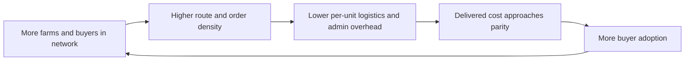
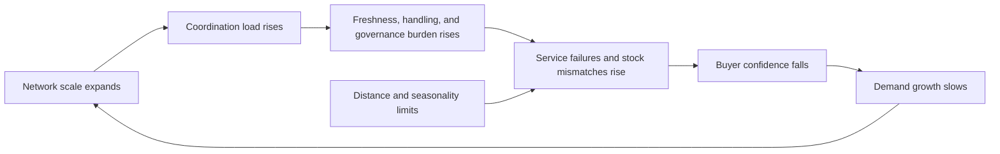

# FND Competitive Analysis in Local Food Procurement

## Executive summary

FND’s strongest starting position is **not** as a generic farm ERP, a consumer discovery app, or a universal data-language company. The repo consistently converges on a narrower and more commercially legible wedge: **buyer-side local procurement orchestration**, with farms participating through lightweight data-sharing and coordination workflows, and with the startup posture closer to a **food brokerage plus software layer** than to a pure software subscription business. That conclusion is explicit in the repo’s buyer-side procurement claim, brokerage posture notes, and two-sided feasibility framing. fileciteturn12file0L1-L1 fileciteturn14file0L1-L1 fileciteturn17file0L1-L1

The external market structure supports that pivot. The latest published national benchmark from entity["organization","USDA National Agricultural Statistics Service","ag statistics agency"] shows **$9.0 billion** in direct farm sales of local food in 2020, with **institutions and intermediaries accounting for 46%** of those sales and direct-to-consumer accounting for 33%; meanwhile, the 2025 Local Food Marketing Practices Survey is in the field, but its results are not yet published. That means the best available official evidence still points to **intermediated channels** as the core scaling path for local food. citeturn2search48turn2search4

The core economic problem is also consistent with the repo’s thesis. Scaling local food is usually constrained less by raw consumer interest than by **coordination cost, service reliability, compliance burden, inventory freshness, and post-farm marketing costs**. entity["organization","USDA Economic Research Service","ag economics agency"] reports that farm establishments received **15.9 cents** of each 2023 domestic food dollar, leaving **84.1 cents** in the marketing share, and official food-hub research shows that food hubs continue to face balancing supply and demand, buyer pricing requirements, and profitability pressure. citeturn3search2turn3search5turn5search0turn5search15

Technically, FND’s **schema-first interoperability** claim is feasible **if it is narrowed** to a procurement domain model and aligned with existing standards and mandates. The current compliance environment already requires richer data exchange for many foods: entity["organization","U.S. Food and Drug Administration","food safety regulator"]’s food traceability rule requires Key Data Elements tied to Critical Tracking Events, with a compliance date of **January 20, 2026**; entity["organization","GS1","standards organization"]’s EPCIS/CBV 2.0 and entity["organization","AgGateway","ag data standards group"]’s ADAPT show that interoperability works when the domain is kept bounded and the governance is explicit. What is **not** feasible in Phase I is proving the repo’s broadest “universal language” claims. citeturn8search1turn9search1turn9search42turn9search3turn9search4 fileciteturn36file0L1-L1

The most defensible business model is therefore: **charge recurring buyers and hubs first**, keep farm-side participation low-friction or free at base level, and treat the initial MVP as a **coordination-and-trust system** for a constrained produce basket within a bounded radius. On that framing, FND can compete against directories, farm SaaS, marketplace software, and enterprise procurement tools by occupying the gap between them: **decentralized-but-practical buyer procurement across fragmented local supply**. fileciteturn12file0L1-L1 fileciteturn14file0L1-L1 fileciteturn47file0L1-L1

## What the repo actually says

The repo’s most important contribution is that it already contains the logic needed to replace the older draft competitive analyses. The center of gravity is no longer “build a better software stack for producers.” It is “solve the buyer-side coordination problem that makes local supply non-routine.” The evidence below is the cleanest synthesis of that shift.

| Repo proposition | Key repo evidence | Analytical implication |
|---|---|---|
| FND has shifted from generic farm tooling toward buyer-side procurement | `analects/0000-00-00-claim-fnd_buyer_side_procurement_is_clearer_customer_than_farmer_tools.md`; `analects/0000-00-00-fragment-fnd_business_model.md`; `analects/2025-02-25-fnd-target_customer.md` fileciteturn12file0L1-L1 fileciteturn13file0L1-L1 fileciteturn43file0L1-L1 | The commercial wedge is clearer on the demand side than on the farm side. Buyers have more immediate willingness to pay for reliability, reduced error, and lower procurement friction. |
| The intended startup posture is closer to brokerage and coordination than to pure SaaS | `analects/0000-00-00-approach-fnd_startup_posture_food_brokerage.md`; `miscellany/proposal/SBIR/phase_1_objectives.txt` fileciteturn14file0L1-L1 fileciteturn44file0L1-L1 | The business is best understood as a coordination layer that can intermediate trust, timing, routing, and matching before it becomes a broader software platform. |
| Phase I is a bounded feasibility study, not agronomic optimization and not proof of universal semantics | `analects/2026-00-00-phase_i-scope.md`; `analects/0000-00-00-boundary-phase_i_is_not_agronomic_optimization.md`; `omnibus/agronomic_mirco_structure.md` fileciteturn15file0L1-L1 fileciteturn16file0L1-L1 fileciteturn47file0L1-L1 | FND should be judged on whether it finds a viable operational window, not on whether it solves generalized agricultural modeling. |
| The dynamical mechanism is sell-through certainty → reinvestment → reliability → more demand | `analects/0000-00-00-mechanism-cyclical_reinvestment_loop.md`; `analects/0000-00-00-mechanism-unsold_output_is_a_planning_constraint.md`; `omnibus/regenerative_farming_market_recapture.md` fileciteturn19file0L1-L1 fileciteturn20file0L1-L1 fileciteturn46file0L1-L1 | The correct operating metric is not just GMV. It is whether procurement stability reduces farm income volatility and enables capacity realization. |
| Data freshness and data-control issues are first-order constraints | `analects/2026-01-19-recap-zephyr_zoidis_localize.md`; `analects/2026-05-01-claim-localize_discovery_layer_exposes_farm_data_freshness_problem.md`; `analects/0000-00-00-claim-data_forfeiture_blocks_local_agriculture_tech_adoption.md` fileciteturn21file0L1-L1 fileciteturn22file0L1-L1 fileciteturn23file0L1-L1 | Discovery without live availability, freshness controls, and governance produces stale supply signals and low trust. |

The repo is also unusually clear about the **chosen operating axis**: farm income volatility. It explicitly frames the constraint as a coordination failure, not merely a production failure or a generic “small farm visibility” problem. It then defines feasibility as a two-sided condition in which farmers are better off or not worse off and buyers reach cost/service parity or improvement. That is a stronger and more operationally meaningful framing than the earlier draft language around large abstract market transformation. fileciteturn18file0L1-L1 fileciteturn17file0L1-L1 fileciteturn47file0L1-L1

The repo’s technical ambition, however, is split across two very different levels. At the **practical level**, the proposal materials describe a fairly standard bounded architecture: a unified vocabulary for farms, crops, orders, attributes, and matching logic, with farms retaining their own systems while FND reconciles differences into a common semantic layer. At the **theoretical level**, some analytic writings make much broader claims about universal language, universal interoperability, and semantic internet infrastructure. The first is commercially useful; the second is not a Phase I commercialization claim and should be treated as speculative background rather than near-term product scope. fileciteturn44file0L1-L1 fileciteturn10file0L1-L1 fileciteturn36file0L1-L1

The repo therefore supports a precise restatement of FND’s approach:

> **FND is best positioned as a buyer-oriented, locality-bounded procurement coordination company that uses a schema-first, decentralized data layer to make fragmented farm supply legible, schedulable, and auditable enough to cross the first two-sided feasibility threshold.** That is substantially narrower, and substantially more investable, than the older draft narrative. fileciteturn12file0L1-L1 fileciteturn14file0L1-L1 fileciteturn47file0L1-L1

## Industry economics and the actual constraint set

The larger food-industry setting strengthens the repo’s narrowing move. Official data still show that local food is economically meaningful, but far from structurally dominant. The last published national local-food benchmark reports **$9.0 billion** in direct farm sales in 2020 and shows that **institutions and intermediaries** already account for nearly half of that activity. The implication is straightforward: if FND wants to matter at system level, it must work where farms meet wholesale, food-hub, institutional, and distribution workflows. citeturn2search48turn3search0

That is especially important because food competitiveness is determined mostly **after** the farm gate. ERS’s Food Dollar series shows that farm establishments received **15.9 cents** of the 2023 domestic food dollar, while the rest flowed to processing, labor, transportation, wholesale, retail, and related services. FND’s thesis is therefore directionally correct when it emphasizes overhead compression and coordination rather than assuming the decisive gains lie in yield alone. citeturn3search2turn3search5turn3search7

The same pattern appears in food-hub research. The 2025 National Food Hub Survey from entity["organization","Michigan State University Center for Regional Food Systems","food systems center"] reports that surveyed hubs purchased from an average of **49 farms**, that institution sales to schools and food banks increased sharply between the 2021 and 2025 surveys, and that many hubs remain pressured by rising operating costs and uncertainty around grant funding. Earlier and current survey waves both identify balancing supply and demand and meeting buyer pricing requirements as central constraints. This is exactly the market gap FND is trying to occupy. citeturn5search15turn5search3turn4search0

Compliance and traceability also matter more now than many old draft analyses assumed. ERS estimated that the cost of complying with the FSMA Produce Rule ranged from **0.3% of annual produce sales for the largest farms to 6.8% for the smallest**, and ERS’s retail-buyer case study found that retailers were likely to continue requiring third-party food-safety audits beyond the baseline rule. In other words, fragmented supply does not just have a matching problem. It also has a **documentation and trust problem**. citeturn3search3turn3search8

Demand-side narratives are also weaker than many local-food founders assume. A meta-regression in *PLOS ONE* found significant heterogeneity and publication-selection bias in willingness-to-pay estimates for local food, and a later field experiment found **no effect** of a generic “locally produced” label on willingness to pay in its tested settings. That means FND should not anchor its economic case on local-premium romanticism. It should anchor it on **service-level reliability, reduced shrink, lower coordination costs, and auditability**. citeturn6search0turn6search1

The repo’s own market-evidence files reach the same conclusion from another angle. They repeatedly argue that local-food economics fail when supply signals are stale, comparison is difficult, and buyers cannot procure from many farms as if they were buying from a coherent source. That is economically plausible, and it is also where FND is least crowded. Discovery apps address search; farm SaaS addresses internal operations; food-hub software addresses multi-vendor storefronts; enterprise procurement platforms address large-scale compliance and ordering. The unfilled middle is **buyer-side orchestration across decentralized local supply with minimal forced standardization**. fileciteturn39file0L1-L1 fileciteturn41file0L1-L1 fileciteturn49file0L1-L1

## Competitive landscape

The competitive field is best understood in five layers: **directories**, **farm SaaS/direct-sales tools**, **food-hub and marketplace platforms**, **open/community infrastructure**, and **enterprise procurement/traceability platforms**. FND’s opportunity is not to beat all of them at their existing game. It is to combine buyer workflows, local coordination, freshness-aware data, and interoperable audit trails in a way that most incumbents do not. The table below profiles the closest named comparators.

| Category | Competitor | Core capability | Primary customers | Interoperability posture | Pricing model | Main constraint versus FND | Sources |
|---|---|---|---|---|---|---|---|
| Directories | entity["company","Localize","farm finder app"] | Consumer farm-finder app with listings, products, and membership features | Consumers | Discovery-oriented; no evidence of deep buyer-system integration on cited pages | Consumer membership/in-app purchases | Good for search; weak for live procurement, freshness assurance, and buyer operations | citeturn12search1 |
| Directories | entity["company","LocalHarvest","local food directory"] | National directory plus CSAware administrative tools | Consumers, farms, CSAs | Directory plus farm admin tools; not centered on multi-buyer procurement | Directory exposure; CSAware pricing not public on cited pages | Strong discovery; weaker on live multi-farm buyer orchestration | citeturn21search0turn21search3 |
| Farm SaaS | entity["company","Barn2Door","farm ecommerce software"] | Online store, POS, subscriptions, inventory, delivery support | Individual farms and ranches | Integrations exist, but posture is single-enterprise commerce first | Public plans from **$119 to $299/mo** plus setup fees | Optimizes direct farm selling, not cross-farm buyer-side pooling | citeturn12search0turn12search2 |
| Farm SaaS / local commerce | entity["company","Local Line","local food commerce platform"] | Multi-channel local commerce, price lists, vendor management, buyer onboarding | Farms, food hubs, buyers | Stronger interoperability posture than most farm SaaS, including ERP/OMS/POS mentions | Public farm plans from **$99 to $399/mo**; buyer plans available | Very credible adjacent competitor; still more centralized SaaS than decentralized federation | citeturn13search0turn13search1turn13search5 |
| Farm SaaS / subscription distribution | entity["company","Harvie","local food sales platform"] | Subscription/local-food distribution platform with marketing support and consumer UX | Farms and local distributors | Platform-centric, with Harvie handling payments and support | **$1,000** setup fee, **7%** transaction fee, optional acquisition fee, card fees | Strong D2C/subscription engine; less aligned to institutional or interoperable buyer procurement | citeturn15search1turn15search0 |
| Open/community infrastructure | entity["organization","Open Food Network","food ecommerce network"] | Open-source marketplace infrastructure for producers, hubs, groups, and communities | Producers, food hubs, buying groups, communities | Highest ideological overlap with decentralized/local infrastructure; open source and globally federated | Local instance-dependent; not standardized as a single commercial SaaS price | Powerful model proof, but governance and commercial execution are diffuse | citeturn16search4turn19search1turn19search3turn19search4 |
| Marketplace / food hub | entity["company","Rooted Farmers","farm marketplace software"] | Marketplace + e-commerce + inventory + analytics for specialty crop farms and hubs | Farms, hubs, wholesale buyers | Centralized marketplace software with some network effects | Public plans from **$14.50/mo** farm-side and **$30.75/mo** hub-side plus transaction fees | Very direct adjacent competitor in local wholesale aggregation; still marketplace-centric rather than schema-first federation | citeturn16search0turn16search1turn16search2 |
| Marketplace / food hub | entity["company","Local Food Marketplace","food hub software"] | Software for farms, food hubs, CSAs, producer reports, recurring orders | Farms, food hubs, markets | More mature operational feature set than most local-food tools; centralized SaaS | Public starter food-hub pricing from **$149/mo** plus setup | Strong incumbent for multi-farm commerce; less differentiated on decentralized interoperability | citeturn17search2turn17search7turn17search8 |
| Marketplace / SBIR neighbor | entity["company","Food4All","virtual food hub platform"] | Producer-led virtual food hub / online marketplace; wholesale and D2C orientation | Farms, buyers, food hubs | Marketplace and systems integration posture; not a schema-first doctrine | Repo evidence points to free seller access and buyer-side transaction fees | Important precedent that validates the market, but it did not solve decentralised interoperability as such | fileciteturn40file0L1-L1 citeturn20search1 |
| Procurement platform | entity["company","Forager","local procurement platform"] | Supplier onboarding, vetting, ordering and local-program management for grocers/restaurants/institutions | Buyers first; producers second | Buyer-centric procurement posture with managed supplier network | Pricing not public; enterprise/custom | Closest proof that buyer-side local procurement is commercially legible; more managed-service than protocol layer | citeturn18search0turn18search12turn18search7 |
| Enterprise supply-chain platform | entity["company","iTradeNetwork","perishables supply chain"] | Order management, traceability, master data, automation, retailer/distributor connectivity | Grower-shippers, distributors, operators, retailers | High interoperability and compliance orientation, but built for larger structured supply chains | Custom enterprise pricing | Strong at scale, weak as an onboarding path for fragmented “missing middle” local supply | citeturn17search0turn17search3 |

The pattern is clear. The directory layer solves **discovery**. Farm SaaS solves **single-enterprise sales and operations**. Food-hub software solves **centralized multi-vendor commerce**. Enterprise platforms solve **high-volume procurement and compliance**. FND’s opportunity sits between these categories: buyer-first procurement for fragmented local supply, but without requiring all participants to surrender operations into one monolithic stack. citeturn12search1turn13search5turn18search12turn17search0

That said, the table also shows where FND is most vulnerable. entity["company","Local Line","local food commerce platform"] and entity["company","Forager","local procurement platform"] are the most serious commercial comparators because they already combine local-food specialization with either buyer workflow or multi-vendor coordination. entity["organization","Open Food Network","food ecommerce network"] is the strongest ideological and architectural comparator because it proves that local-food commerce can be organized as shared infrastructure rather than a purely proprietary SaaS silo. FND must therefore win on **freshness-aware interoperability and buyer-side operational fit**, not on generic “we help local food” positioning. citeturn13search0turn18search0turn19search1

## Technical feasibility of the Mycite schema-first approach

A narrow version of FND’s technical claim is feasible. A broad version is not.

The narrow version is this: FND can define a canonical procurement-and-traceability schema for a bounded local-food domain — farms, products, attributes, availability windows, lots, buyer specs, orders, commitments, substitutions, pickup/delivery windows, and fulfillment/traceability events — and then build adapters from farm spreadsheets, basic software tools, and buyer order workflows into that schema. The repo’s practical proposal materials repeatedly describe exactly this kind of unified vocabulary and matching engine. fileciteturn44file0L1-L1 fileciteturn10file0L1-L1

That narrow version is also consistent with the direction of formal supply-chain standards. entity["organization","GS1","standards organization"] EPCIS/CBV 2.0 is explicitly designed to capture interoperable event data about object status, location, movement, and chain of custody, and now includes JSON/JSON-LD, REST bindings, sensor data, and certification details. entity["organization","U.S. Food and Drug Administration","food safety regulator"]’s FSMA food-traceability rule likewise works through bounded **Critical Tracking Events** and **Key Data Elements**, not through universal semantic representation. And the produce industry’s PTI guidance remains grounded in GS1 identifiers and case-level traceability. citeturn9search1turn9search42turn8search1turn11search0turn11search12

The broad version — that FND is proving a universal semantic language that removes the need for conventional interoperability engineering — is not credible as an investable near-term claim. Even the existing standards bodies work by **limiting domain scope**, specifying governance, and constraining the data model to classes of events and identifiers that counterparties can actually implement. The repo’s broadest Mycite writings are therefore best treated as philosophical motivation rather than product scope. citeturn9search1turn9search3turn9search4 fileciteturn36file0L1-L1

The highest-confidence technical reading is therefore:

- **Feasible**: internal canonical schema, event log, attribute normalization, freshness-aware publishing, buyer-order reconciliation, audit trails, compatibility with GS1/FSMA concepts, and limited federation across different farm and buyer tools. citeturn8search1turn9search1turn9search3
- **Conditionally feasible**: generalized adapter layer across many local-food tools, certifications, and buyers, provided scope is narrow and governance is explicit. citeturn9search1turn9search3turn11search0
- **Not Phase I feasible**: proving universal semantics, universal machine interpretability, or frictionless interoperability across arbitrary domains. fileciteturn36file0L1-L1

The most important concrete risk is **data freshness**. The repo itself already noticed that directory-style systems expose stale supply and weak trust. In local produce procurement, stale availability is not a minor UX issue; it is a direct destroyer of buyer confidence and fill rate. If FND cannot guarantee freshness windows, timestamped availability, and explicit staleness fallbacks, it will regress into the same category as discovery products. fileciteturn21file0L1-L1 fileciteturn22file0L1-L1

The correct mitigation stack is straightforward:

1. **Scope the ontology narrowly** to produce procurement and traceability events.  
2. **Adopt external identifiers where possible** instead of inventing every semantic primitive.  
3. **Treat “freshness” as first-class data**, with timestamps, expiration logic, and buyer-visible confidence.  
4. **Use human override and exception handling** rather than pretending the system will fully automate ambiguous farm conditions.  
5. **Align output with buyer compliance requirements**, especially traceability lots, chain-of-custody logic, pack/lot references, and audit trails. citeturn8search1turn8search5turn9search1turn11search12

In short, the Mycite claim becomes commercially strong only after it is translated into a much more ordinary sentence:

> **FND can be a schema-first interoperability layer for local produce procurement.**  
> That is feasible.  
> **FND as a universal semantic internet is not the relevant investment claim.** fileciteturn44file0L1-L1 fileciteturn36file0L1-L1

## Market and financial feasibility

The repo’s own methodological choice is the right one: model feasibility through **current output plus capacity bands**, not agronomic optimization. The scenarios below therefore use the repo’s two-sided feasibility logic, USDA local-food channel benchmarks, USDA reefer truck-rate bands, and ERS food-loss benchmarks to illustrate where FND likely crosses from “interesting pilot” to “commercially legible routine procurement.” These are **illustrative scenario models, not forecasts**. fileciteturn16file0L1-L1 fileciteturn17file0L1-L1 fileciteturn47file0L1-L1 citeturn2search48turn7search24turn7search0turn7search1

**Model note.** The delivered-cost comparison assumes an illustrative conventional line-haul baseline around 1,000 miles versus local coordinated movements within roughly 50–100 miles; AMS Q2 2024 refrigerated truck rates imply that line-haul alone can differ by several cents per pound, but early local systems often give back some of that advantage through low route density, small-drop complexity, and handling overhead. That is why the early scenario is not yet cheaper than baseline even though distance is shorter. citeturn7search24turn3search5

| Scenario | Produce basket size | Participating farms | Buyer demand covered | Fill rate | Delivered cost vs baseline | Farmer gross-margin change | Income volatility change | Waste reduction | FND revenue opportunity |
|---|---:|---:|---:|---:|---:|---:|---:|---:|---:|
| Proof lane | ~600 lb/buyer/week across 4 buyers | 8 | 10% | 84% | **+3%** | **+5%** | **-8%** | **-7%** | **~$40k/yr** |
| Single-hub routine | ~1,000 lb/buyer/week across 10 buyers | 20 | 18% | 90% | **0%** | **+10%** | **-15%** | **-12%** | **~$100k/yr** |
| County network | ~1,650 lb/buyer/week across 20 buyers | 45 | 29% | 94% | **-2%** | **+14%** | **-24%** | **-18%** | **~$220k/yr** |
| Regional multi-hub | ~2,800 lb/buyer/week across 40 buyers | 90 | 42% | 96% | **-4%** | **+18%** | **-31%** | **-23%** | **~$500k/yr** |

The key result is structural rather than numeric: **FND does not need to win total produce demand to become viable**. It only needs to win a **bounded, frequent, locally substitutable basket** with enough route density and enough assortment breadth to become predictable. That is exactly the “critical point” the repo describes. Once there, the system can translate lower mismatch risk into higher reinvestment, better fill rates, and more buyer trust. fileciteturn19file0L1-L1 fileciteturn46file0L1-L1 fileciteturn47file0L1-L1

The scenarios also imply a specific financing logic. A proof lane can create credible evidence, but it does not yet produce decisive buyer economics. The **single-hub routine** scenario is the first one that looks commercially legible: cost parity, 90% fill rate, visible waste reduction, and enough recurring buyer activity to support low six-figure annual software-plus-service revenue. The **county network** scenario is the first one that looks strategically defensible, because it creates meaningful basket coverage, route density, and a larger data moat. fileciteturn17file0L1-L1 fileciteturn47file0L1-L1

### Causal loops

The repo’s dynamics are strong enough to express directly.

**Income-stabilization loop.** The underlying logic is that sell-through certainty lowers perceived overproduction risk, which increases reinvestment and reliability, which in turn raises repeat purchasing. fileciteturn19file0L1-L1 fileciteturn47file0L1-L1

**Cost-compression loop.** As more farms and buyers transact through the same coordination layer, route density and administrative efficiency improve, which lowers delivered overhead and increases adoption. fileciteturn46file0L1-L1 fileciteturn47file0L1-L1 citeturn7search24turn3search5

**Limiting-boundaries loop.** Growth does not compound indefinitely. Distance, handling capacity, assortment limits, and stale data can reverse the loop by degrading service levels. fileciteturn20file0L1-L1 fileciteturn22file0L1-L1 fileciteturn47file0L1-L1

## Strategic recommendations

The go-to-market should follow the repo’s own strongest logic: start where the willingness to pay is clearest and the workflow pain is chronic.

The first target customer should be **recurring buyers** — independent grocers, institutions with local-food mandates, and food hubs that already buy from multiple farms but still coordinate through fragmented spreadsheets, emails, texts, and partial software stacks. The repo’s own internal shift toward buyer-side procurement is correct, and the external market shows that intermediated channels are where scale exists. fileciteturn12file0L1-L1 fileciteturn14file0L1-L1 citeturn2search48turn3search0

The pricing model should therefore be **buyer-first**.

A defensible starting recommendation is:

- **Buyer / hub fee**: **$750–$1,500 per location per month**, depending on order volume and reporting needs.
- **Coordination / GMV fee**: **1.0%–2.0%** on successfully transacted local volume.
- **Farm fee**: **free at base level** during onboarding and early network formation; optional premium modules later for advanced reporting, compliance exports, or forecasting.

This is consistent with both the repo’s buyer-side posture and the market’s observed software pricing envelope. Farm tools such as entity["company","Barn2Door","farm ecommerce software"], entity["company","Local Line","local food commerce platform"], entity["company","Harvie","local food sales platform"], and entity["company","Rooted Farmers","farm marketplace software"] already normalize monthly fees and/or transaction fees on the seller side; FND’s chance to differentiate is to **move most cost to the buyer workflow where the ROI is easier to prove**. citeturn12search0turn13search0turn15search1turn16search0turn17search2

Partnership strategy should prioritize **food hubs and regional distributors**, not because they are the final destination, but because they are the fastest route to density. A food hub or local distributor already solves part of the aggregation problem; FND can become the layer that improves data freshness, fill-rate forecasting, buyer reporting, and cross-supplier comparability. This also reduces the cold-start problem, because the platform onboards a cluster rather than farm-by-farm atomization. The most promising partnership classes are therefore: established food hubs, mission-driven regional grocers, school-food and hospital procurement programs, and distributors with a visible “local” assortment but weak supplier orchestration. citeturn5search15turn18search12turn17search0

The Phase I MVP should be narrow.

It should include:

1. a bounded canonical schema for farms, products, attributes, lots, availability, orders, and fulfillment events;  
2. farm availability ingestion from lightweight sources;  
3. buyer order-sheet or requisition intake;  
4. matching logic that respects radius, readiness window, substitutions, and freshness;  
5. fill-rate, cost, and waste simulation against baseline;  
6. traceability-event logging consistent with buyer audit expectations;  
7. explicit freshness/staleness controls and human override. fileciteturn44file0L1-L1 fileciteturn15file0L1-L1 fileciteturn16file0L1-L1

It should **exclude**: full agronomic optimization, generalized farmer ERP, consumer marketplace ambitions, and universal semantic claims. Those are dilution risks, not MVP necessities. fileciteturn16file0L1-L1 fileciteturn36file0L1-L1

Strategically, the strongest positioning sentence is:

> **FND helps recurring buyers source from fragmented local farms with enterprise-grade reliability, without forcing every participant into one centralized software stack.**

That positioning is sharper than “local food platform,” more practical than “semantic internet,” and more defensible than “farm software.” It directly targets the gap between local discovery products and enterprise procurement systems. fileciteturn12file0L1-L1 citeturn18search12turn17search0

## Data, methods, and limitations

This report prioritizes the connected GitHub repo and then uses official and primary external sources: entity["organization","U.S. Department of Agriculture","federal agency"], its component agencies including entity["organization","USDA National Agricultural Statistics Service","ag statistics agency"], entity["organization","USDA Economic Research Service","ag economics agency"], and entity["organization","USDA Agricultural Marketing Service","ag marketing agency"]; entity["organization","U.S. Food and Drug Administration","food safety regulator"]; entity["organization","GS1","standards organization"]; entity["organization","AgGateway","ag data standards group"]; peer-reviewed papers on local-food willingness to pay; and official vendor websites for competitors. citeturn2search48turn3search2turn7search24turn8search1turn9search1turn9search3turn6search0turn6search1

The scenario model uses the repo’s explicit method choice: **current output plus capacity bands**, not agronomic optimization. It also uses the repo’s own selected outcome variables: buyer-side parity, fill rate, waste, and farm income volatility. fileciteturn16file0L1-L1 fileciteturn17file0L1-L1 fileciteturn18file0L1-L1 fileciteturn47file0L1-L1

The following unspecified items were not provided concretely in the repo and are therefore modeled as explicit assumptions:

- blended buyer-side produce value of roughly **$2.10/lb** for the servicable basket;
- a **40-week** active local-procurement period for scenario annualization;
- buyer-side annual software/service pricing of roughly **$9,000/account** plus **1.5% GMV** in the scenario table;
- bounded local radius of roughly **50–100 miles** and conventional comparator around **1,000 miles** for illustrative freight effects;
- waste-reduction gains interpreted as a reduction in avoidable mismatch and unsold-output losses, not total end-to-end food waste;
- fill-rate improvement driven by coordination, density, and assortment, not by agronomic yield maximization. citeturn7search24turn7search0turn7search1 fileciteturn47file0L1-L1

There are also important limitations.

The GitHub connector returned file contents as single-line payloads, so repo citations can only point to the captured file line rather than granular per-paragraph line ranges. The 2020 Local Food Marketing Practices Survey remains the latest published national local-food benchmark because the 2025 survey is still in process. Public pricing information is uneven across competitors; where public pricing was not shown on cited official pages, this report labels pricing as custom or not public rather than inferring it. And the market-feasibility scenarios are **decision-support models**, not historical measurements. citeturn2search4

The main open questions are operational, not conceptual:

- Which exact buyer cohort will be used for the first lane: independent grocers, institutions, or hub/distributor partners?
- Which produce basket is narrow enough to be reliable but broad enough to matter?
- What minimum freshness SLA can farms actually meet without raising admin burden beyond willingness to participate?
- Which external standards will FND support natively in Phase I versus Phase II?
- How much human brokerage labor remains in the loop before software margins begin to scale? fileciteturn15file0L1-L1 fileciteturn17file0L1-L1 fileciteturn22file0L1-L1

The answer to those questions will determine whether FND becomes a credible procurement infrastructure company or remains an interesting but over-broad systems thesis. The repo, however, already contains the right foundation: **focus the business on buyer-side coordination, keep the technical scope bounded, and win the first reliable basket before claiming the whole food system.** fileciteturn12file0L1-L1 fileciteturn14file0L1-L1 fileciteturn47file0L1-L1