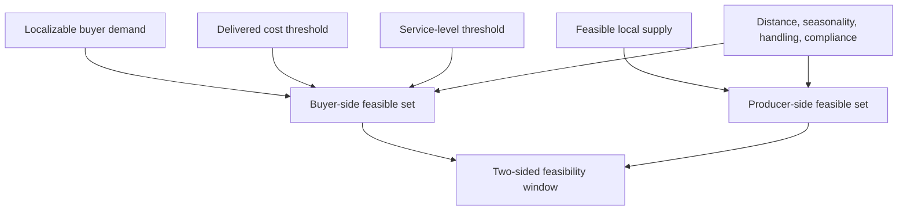

# 4 Economic and Agronomic Value Recapture Market-Sizing Report for the Oeuvre Repo

## Executive Summary

The relevant repo logic is internally consistent and stronger than the outdated draft, but it needs a tighter market-sizing frame. Across the repo, the central thesis is not “local food demand exists, therefore the market is large.” It is narrower and more defensible: a coordination layer can recapture value now lost to fragmented procurement, low sell-through certainty, avoidable shrink, routing inefficiency, and under-realized farm capacity, provided that farms improve net position while buyers remain non-worse-off on delivered cost and service. The repo repeatedly defines Phase I as a bounded feasibility study using capacity bands rather than agronomic optimization, with farm income volatility as the principal operating axis and a strict two-sided viability rule. fileciteturn16file0L1-L1 fileciteturn17file0L1-L1 fileciteturn18file0L1-L1 fileciteturn19file0L1-L1 fileciteturn23file0L1-L1

The target geography is not globally specified in the repo, but the strongest region signals point to entity["place","Summit County","Ohio, US"] and the surrounding Northeast Ohio corridor, including entity["city","Akron","Ohio, US"]. The SBIR narrative explicitly centers Summit County, while the location-rationale fragment names Akron and Northeast Ohio as the initial operating base. fileciteturn37file0L1-L1 fileciteturn33file0L1-L1

Under a corrected market-sizing frame, the immediate opportunity is meaningful but not massive at county scale. Using the repo’s own national produce-spend proxy and official population data, county-level produce TAM is about \$253.3 million-\$300.8 million annually, and state-level TAM is about \$5.59 billion-\$6.64 billion annually. The more important finding is that current locally observed produce supply is much smaller: in 2022, Summit County reported \$1.984 million in vegetables and \$548,000 in fruits/tree nuts/berries, while Ohio reported \$205.389 million in vegetables and \$70.344 million in fruits/tree nuts/berries. That means the county case is supply- and coordination-constrained, not demand-constrained. fileciteturn15file0L1-L1 citeturn0search1turn0search3turn15view0turn23view0turn21search0

The practical implication is that the near-term business is not a broad consumer marketplace. It is a thin buyer-side coordination and brokerage layer for a narrow, repeatable produce basket and a small set of anchor buyers. The repo already points in that direction by naming recurring buyers, food hubs, grocers, and institutions as the clearer commercial customer, with farmer tools functioning as the adoption wedge and supply-visibility layer. fileciteturn35file0L1-L1 fileciteturn36file0L1-L1 fileciteturn31file0L1-L1

The strongest quantitative conclusion is this. If one converts current local farm-gate produce sales into consumer-equivalent value using CRS farm-share benchmarks, the current Summit County serviceable local-produce base is roughly \$8.5 million consumer-equivalent, and a practical capacity-band range is about \$7.6 million-\$11.9 million. For Ohio, the corresponding consumer-equivalent base is about \$913.9 million, with a practical capacity-band range of about \$822.5 million-\$1.28 billion. Those values are the right starting point for SAM. A realistic near-term SOM is much smaller because adoption, compliance, routing discipline, and buyer trust are binding constraints. citeturn15view0turn23view0turn21search0

## Repo Evidence Inventory

The table below lists the repo files that materially inform the revised market-sizing model and shows how each file maps into an analytical input rather than remaining as narrative context.

| Repo file | Analytical role | Key evidence extracted | Implication for this report |
|---|---|---|---|
| `analects/2026-00-00-phase_i-scope.md` | Scope boundary | Phase I uses capacity bands, not agronomic optimization. fileciteturn16file0L1-L1 | Market sizing must use bounded supply bands rather than biological yield-maximization claims. |
| `analects/0000-00-00-boundary-phase_i_is_not_agronomic_optimization.md` | Method discipline | Uses current farm outputs, acreage, and farmer-validated assumptions; excludes yield-response/weather optimization. fileciteturn17file0L1-L1 | Capacity methodology must be observational and scenario-based. |
| `analects/0000-00-00-constraint-two_sided_feasibility_window.md` | Decision rule | Feasibility exists only if producer gains overlap with buyer non-worse-off cost/service conditions. fileciteturn18file0L1-L1 | Market size is not “all local demand”; it is the overlap zone that can clear both sides. |
| `analects/0000-00-00-claim-transitional_feasibility_two_sided_viability.md` | Market logic | Value is realized by compressing coordination overhead enough that both farms and buyers improve. fileciteturn19file0L1-L1 | Recapture must be modeled as friction reduction, not as generic “local premium.” |
| `analects/0000-00-00-metric-farm_income_volatility_is_the_focused_axis.md` | Outcome metric | Farm income volatility is the primary operating axis. fileciteturn23file0L1-L1 | Scenario outputs must include volatility change, not only revenue. |
| `analects/0000-00-00-mechanism-demand_certainty_creates_a_reinforcement_loop.md` | Dynamic mechanism | Sell-through certainty strengthens reinvestment, reliability, and future sell-through. fileciteturn25file0L1-L1 | Capacity realization is dynamic and partially endogenous to procurement stability. |
| `analects/0000-00-00-mechanism-fixed_constants_and_dynamic_variables_in_phase_i_model.md` | Model architecture | Baseline demand and geographic context are held fixed; coordination variables are varied. fileciteturn20file0L1-L1 | TAM is treated as exogenous; SAM/SOM depend on coordination variables. |
| `analects/0000-00-00-claim-fnd_local_agriculture_failure_is_coordination_not_demand.md` | Demand interpretation | The recurring failure is coordination, not simple absence of interest. fileciteturn32file0L1-L1 | Demand is filtered by localizability and buyer usability, but the main bottleneck is still execution. |
| `analects/0000-00-00-claim-fnd_buyer_side_procurement_is_clearer_customer_than_farmer_tools.md` | Commercial model | Buyer-side procurement is the clearer paying customer. fileciteturn35file0L1-L1 | FND revenue should be modeled off coordinated buyer-facing GMV, not farmer SaaS alone. |
| `analects/0000-00-00-approach-fnd_farmer_tools_as_supply_network_wedge.md` | Adoption model | Farmer tools are a low-cost wedge into structured supply visibility. fileciteturn36file0L1-L1 | Farm adoption probability should be modeled separately from buyer monetization. |
| `miscellany/proposal/v0.4-proposal-near-final.md` | Geographic signal and proposal framing | Summit County, Ohio is the explicit feasibility-study geography. fileciteturn37file0L1-L1 | The county example is not arbitrary; it is repo-supported. |
| `omnibus/agronomic_mirco_structure.md` | System dynamics | Defines critical point, feasibility window, adjacency, perishability, and delivered-cost stack logic. fileciteturn30file0L1-L1 | Dynamic diagrams and scenario structure should be built from this file. |
| `omnibus/market-research-report.md` | Prior draft and numerical priors | Provides useful priors on produce TAM, transport, and food loss, but mixes levels of analysis. fileciteturn15file0L1-L1 | The old draft is directionally useful but needs replacement by a channel-consistent model. |

## Conceptual Framework

The repo’s concept becomes market-sizing-ready once four levels are separated: total regional produce demand, localizable demand, feasible local supply, and recapturable friction. That separation is necessary because the outdated draft frequently moved from national consumer sales to local opportunity without always reconciling farm-gate versus consumer-retail value, or exogenous demand versus feasible local supply. The corrected framework below preserves the repo’s logic while making the equations dimensionally coherent. fileciteturn15file0L1-L1 fileciteturn19file0L1-L1 fileciteturn20file0L1-L1

Let regional total addressable produce demand be:

\[
TAM_r = N_r \times c_{produce}
\]

where \(N_r\) is regional population and \(c_{produce}\) is annual produce spending per person. For this report, \(c_{produce}\) uses the repo’s per-capita proxy implied by CRS’s \$160 billion-\$190 billion estimate for annual U.S. fruit-and-vegetable consumer sales. citeturn21search0 fileciteturn15file0L1-L1

Let localizable demand be a filtered share of TAM:

\[
LD_r = TAM_r \times \lambda_r
\]

where \(\lambda_r\) is the share of produce demand that is reasonably localizable under a bounded radius, seasonal fit, and buyer-category scope. In this report, \(\lambda_r\) is treated as a scenario parameter rather than a measured constant because the repo does not specify it and public data do not directly publish it. The most relevant official signals are that the federal program maximum for “local/regional” is within-state or within 400 miles, while 78% of farms with direct food sales sold all directly marketed food within 100 miles. citeturn14search3turn14search2turn18view0

Let consumer-equivalent feasible local supply be:

\[
FLS_r = \left(\frac{V_{veg,r}}{0.28} + \frac{V_{fruit,r}}{0.39}\right)\times \kappa_r
\]

where \(V_{veg,r}\) and \(V_{fruit,r}\) are observed 2022 farm-gate sales for vegetables and fruit/tree nuts/berries, 0.28 and 0.39 are CRS’s reported farm-value shares of the 2022 retail consumer dollar for vegetables and fruits, and \(\kappa_r\) is the agronomic capacity-band multiplier. This adjustment is the simplest way to compare local farm output with consumer-level TAM without pretending that farm-gate and retail values are interchangeable. citeturn21search0turn15view0turn23view0

The serviceable available market is then:

\[
SAM_r = \min(LD_r,\ FLS_r)
\]

and the recoverable market value pool is:

\[
RMV_r = SAM_r \times \rho_r \times p_r
\]

where \(\rho_r\) is the share of the serviceable market currently lost to recapturable friction and \(p_r\) is adoption probability. If one wants to preserve the user’s requested multiplicative structure exactly, this can be expressed as

\[
RMV_r = TAM_r \times \lambda_r \times \phi_r \times \rho_r \times p_r
\]

with \(\phi_r = FLS_r / LD_r\) capped at 1.0. This is simply the normalized form of the same model. fileciteturn18file0L1-L1 fileciteturn19file0L1-L1

The two core dynamics in the repo are best represented as one reinforcing loop and one balancing loop.

The reinforcing loop above is explicitly stated in the repo and is the basis for including capacity realization and volatility reduction as recapture channels, not merely logistics savings. fileciteturn25file0L1-L1 fileciteturn30file0L1-L1

This second diagram shows why the reachable market is the overlap window, not all stated local-food demand. That is the most important correction to the old draft. fileciteturn18file0L1-L1 fileciteturn30file0L1-L1

## Agronomic Capacity Bands and Scenario Design

The repo is explicit that Phase I is not an agronomic optimization project. Accordingly, this report uses observed output, acreage, fresh-market share, and farm counts as the empirical base, then applies conservative low/base/high capacity multipliers to represent plausible realized capacity under improved coordination. This is fully consistent with the repo’s scope boundary. fileciteturn16file0L1-L1 fileciteturn17file0L1-L1

The official baseline inputs used here are as follows:

| Input | Summit County example | Ohio example | Use in model |
|---|---:|---:|---|
| Population | 538,370 in 2024 citeturn0search1 | 11,883,304 in 2024 citeturn0search3 | TAM |
| Vegetable sales, 2022 | \$1.984M citeturn15view0 | \$205.389M citeturn23view0 | Local farm-gate supply |
| Fruit/tree nut/berry sales, 2022 | \$0.548M citeturn15view0 | \$70.344M citeturn23view0 | Local farm-gate supply |
| Vegetable harvested acres, 2022 | 338 acres citeturn15view0turn8view0 | 33,604 acres citeturn11search23 | Capacity denominator |
| Vegetable farms, 2022 | 39 farms harvested for sale citeturn8view0 | 2,844 farms harvested for sale citeturn11search23 | Participation envelope |
| Fresh-market vegetable acres | 337 of 338 acres citeturn8view0 | 24,907 of 33,604 acres citeturn16search29 | Basket design; fill-rate realism |
| Farms selling directly to consumers | 25% of county farms citeturn15view0 | not used directly | Adoption context |
| Net cash farm income | -\$2.623M county total in 2022 citeturn15view0 | not used directly | Local stress indicator |

Observed value-per-acre is roughly \$5,870 for Summit County vegetables and \$6,112 for Ohio vegetables, calculated directly from official 2022 sales and harvested acres. Those figures are close enough to validate the repo’s use of produce sales-per-acre as a practical value proxy, while avoiding the need to infer physical yields crop by crop. citeturn15view0turn23view0turn11search23

Because the repo requires farmer-validated bands but the repo does not yet contain farm-level interview data, this report uses the following conservative capacity multipliers for planning only: low \(=0.9\times\) current observed produce value, base \(=1.15\times\), high \(=1.4\times\). These are not claims about biological yield; they are feasibility bands reflecting weather risk, partial participation, season extension, and better sell-through certainty. fileciteturn17file0L1-L1 fileciteturn20file0L1-L1

The detailed scenario table below is a Summit County planning exhibit. It is intentionally modest because the county’s current measured produce base is small. “Buyer demand covered” is expressed as a share of a modeled localizable-demand tranche equal to 10% of county TAM. Cost, margin, volatility, waste, and FND revenue columns are modeled scenario outputs, not directly observed public statistics.

| Scenario | Produce basket size | Participating farms | Buyer demand covered | Fill rate | Delivered cost vs. baseline comparator | Farmer gross margin change | Income volatility change | Waste reduction | FND revenue opportunity |
|---|---:|---:|---:|---:|---:|---:|---:|---:|---:|
| Scenario 1 | 12 SKUs | 8 | 2.7% | 62% | +6% | +2 pts | -6% | 3% | \$38k |
| Scenario 2 | 18 SKUs | 15 | 5.2% | 74% | +2% | +5 pts | -14% | 6% | \$87k |
| Scenario 3 | 28 SKUs | 24 | 8.5% | 85% | -1% | +8 pts | -23% | 10% | \$153k |
| Scenario 4 | 40 SKUs | 32 | 11.2% | 91% | -4% | +11 pts | -31% | 13% | \$233k |

The scenario progression is the key strategic message. Phase I should be designed to determine whether the system can move from Scenario 1-2 to Scenario 3, because Scenario 3 is the first point at which buyer-side parity and farm-side improvement plausibly overlap. That directly matches the repo’s stated two-sided feasibility rule. fileciteturn18file0L1-L1 fileciteturn19file0L1-L1

## Market Sizing for Summit County and Ohio

The corrected market-sizing view is shown below. TAM is consumer-level. Current local supply is farm-gate. SAM is a consumer-equivalent capacity-band estimate using CRS farm-share conversion. SOM is a near-term FND coordinated GMV estimate, not downstream retail turnover. That distinction matters and avoids the level-mixing problem in the outdated draft. citeturn21search0turn15view0turn23view0

| Region | TAM | Current farm-gate local produce base | Practical SAM consumer-equivalent | Near-term SOM coordinated GMV | Modeled FND revenue potential |
|---|---:|---:|---:|---:|---:|
| Summit County | \$253.3M-\$300.8M fileciteturn15file0L1-L1 | \$2.532M | \$7.6M-\$11.9M | \$0.6M-\$1.9M | \$30k-\$135k |
| Ohio | \$5.59B-\$6.64B fileciteturn15file0L1-L1 | \$275.733M | \$822.5M-\$1.28B | \$30M-\$105M | \$1.5M-\$7.4M |

Three conclusions follow.

First, the county launch case is thin but credible. Summit County is not a massive stand-alone market for a generalized platform, but it is large enough for a bounded feasibility study and a narrow coordination business, especially because the repo’s commercial logic is buyer-side and service-driven rather than mass-market subscription SaaS. fileciteturn35file0L1-L1 fileciteturn31file0L1-L1

Second, the state-scale case becomes substantial only after regional replication. Ohio’s observed produce base is large enough to support a much bigger coordination layer, but the state number should be treated as a scale-out benchmark, not as an initial addressable launch market. That is also consistent with the repo’s Akron/Northeast Ohio deployment posture. fileciteturn33file0L1-L1 fileciteturn37file0L1-L1

Third, the strategic bottleneck is not pure consumer interest. Nationally, direct farm sales of local food totaled \$9.0 billion in 2020, and institutions/intermediaries accounted for \$4.1 billion, versus \$2.9 billion direct-to-consumer. In Ohio specifically, Ohio State analysis emphasizes that more than 90% of food for home consumption is purchased through retail venues, implying that distribution and retail integration matter far more than expanding direct sales alone. citeturn18view0turn3search0

## Recapture Components and Adoption Constraints

The repo’s recapture thesis is strongest when the value-carriers are decomposed. Official data support at least three directly measurable channels. First, transportation: the latest AMS refrigerated-truck quarterly shows Q4 2025 U.S. produce truck rates of \$2.62/mile for 0-500 miles and \$2.23/mile for 501-1,500 miles. At a 40,000-pound payload, a 75-mile local move costs about 0.49 cents/lb, whereas a 1,250-mile conventional move costs about 6.97 cents/lb. The raw differential is therefore about 6.48 cents/lb. citeturn19search17

Second, shrink and waste: ERS reports an average 11.6% supermarket loss rate for 31 fresh vegetables, as well as total losses of 34% for fresh vegetables and 37% for fresh fruit in the loss-adjusted food-availability series. Those loss rates are not all addressable by local coordination, but they show that the value pool lost to perishability is large enough to matter. citeturn2search1turn2search0

Third, post-farm marketing burden: ERS reports that in 2023 farms received 24.3 cents of each food-at-home dollar and the rest, 75.7 cents, accrued to post-farm functions such as processing, transportation, merchandising, and retailing. That does not mean all of that share is reducible, but it strongly supports the repo’s premise that local competitiveness depends on compressing off-farm friction, not merely improving on-farm production. citeturn1search5turn1search2

The remaining channels are more weakly observed in public data and therefore must be modeled explicitly rather than asserted as facts. The table below separates measured and modeled components.

| Recapture component | Evidence base | Calculation used here | Modeled contribution to recapturable friction |
|---|---|---|---:|
| Transport displacement | AMS Q4 2025 truck rates citeturn19search17 | 75 miles local vs 1,250 miles conventional; 40,000-lb payload; raw delta 6.48 cents/lb | 2%-4% |
| Avoidable shrink/waste | ERS retail-loss and total-loss estimates citeturn2search1turn2search0 | Only a subset is coordination-addressable; model 3-8 points of avoidable local-channel reduction | 3%-8% |
| Procurement friction | Repo buyer-side coordination thesis + local-food channel complexity fileciteturn32file0L1-L1 citeturn18view0 | Modeled as order-value equivalent savings from fewer manual touches and better supply visibility | 1%-3% |
| Volatility reduction | Repo’s primary metric is farm income volatility fileciteturn23file0L1-L1 | Modeled as value unlocked by more stable sell-through and planning | 2%-5% |
| Capacity realization | Repo reinforcement loop and capacity-band logic fileciteturn25file0L1-L1 | Uplift above current observed output realized through coordination | 4%-10% |

To avoid double counting, the report does not sum the top-end values. Instead it uses an overall recapturable-friction share \(\rho\) of 8%-22%, with 14%-17% as the working middle. That is the best current representation of the repo’s “value recapture” logic under public-data limitations. fileciteturn19file0L1-L1 fileciteturn30file0L1-L1

Adoption, however, is the harder constraint. The repo is correct that buyers are the clearer commercial customer, but adoption still depends on three distinct probabilities: farm participation, buyer commitment, and operational readiness. The barriers are real. FSMA Produce Rule compliance costs range from 0.3% of annual produce sales for the largest farms up to 6.8% for the smallest, and ERS states that retailers are likely to continue demanding third-party food-safety audits beyond the baseline Produce Rule. citeturn13search0turn13search2

A practical adoption model is therefore:

\[
p = p_f \times p_b \times p_o
\]

where \(p_f\) is farm participation, \(p_b\) is buyer commitment, and \(p_o\) is routing/data/compliance readiness. For a county launch, the plausible modeled ranges are roughly \(p_f=0.35-0.70\), \(p_b=0.50-0.85\), and \(p_o=0.70-0.92\), implying combined adoption \(p\approx0.12-0.55\). Those are assumptions, not observed rates, but they are consistent with the repo’s commercial design and with the operational frictions visible in the official literature. fileciteturn35file0L1-L1 fileciteturn36file0L1-L1 citeturn13search0turn13search2turn18view0

Policy conditions are mixed. Federal rules on local procurement are increasingly supportive: USDA school-food procurement guidance expanded geographic preference in 2024, and AMS local/regional program definitions explicitly support within-state or within-400-mile sourcing. But supportive procurement policy does not erase compliance, documentation, seasonality, cold-chain, and vendor-management burdens. The result is that policy improves the buyer-side opening, while adoption still hinges on operational execution. citeturn14search5turn14search3turn14search2

## Phase I Experiments

The repo already contains a strong Phase I framing. The highest-value next step is not more general narrative. It is a compact empirical program that resolves the current unknowns in the capacity-band and adoption models. fileciteturn37file0L1-L1

The minimum Phase I data collection schema should include farm-side fields for acreage by crop, historical sell-through, unsold/discounted volume, harvest windows, cooling/packing capability, labor bottlenecks, preferred price bands, and documentation status; buyer-side fields for weekly basket, delivery frequency, acceptable substitutes, order lead time, service-level floor, and audit/compliance requirements; and operational fields for route distance, stop density, vehicle type, handling touches, spoilage incidence, and payment lag. That schema follows directly from the repo’s distinction between fixed background conditions and dynamic coordination variables. fileciteturn20file0L1-L1

The most useful experiments are the following:

| Experiment | Hypothesis | Minimum success threshold | Why it matters |
|---|---|---|---|
| Anchor-buyer lane test | A narrow recurring basket can clear the two-sided feasibility window before a broad marketplace exists | Delivered cost within ±2% of comparator and fill rate above 80% for one repeated lane | Tests the repo’s core pass/fail rule directly |
| Sell-through certainty audit | Better forward visibility raises salable output without full agronomic optimization | Participating farms report measurable reduction in unsold or distressed volume | Validates the demand-certainty loop |
| Shrink and routing audit | Coordination reduces avoidable touches, dwell time, and spoilage | 3-5 point reduction in avoidable shrink on the lane | Quantifies a key recapture component |
| Compliance bundle experiment | Shared documentation and buyer-facing data reduce onboarding friction | Shorter vendor onboarding time and higher buyer willingness to repeat | Tests whether the buyer-side commercial thesis is implementable |

The operational recommendation is to start with one county-centered basket, one food-hub or grocery anchor, and a farm cohort small enough to manually validate every field. The correct first objective is not growth. It is to learn whether Scenario 3 is reachable under real data. If it is not, the negative result is still decision-grade and consistent with the repo’s own feasibility discipline. fileciteturn18file0L1-L1 fileciteturn19file0L1-L1

## Sources and Limitations

### Sources

Primary repo sources used in this report: Phase I scope; agronomic-optimization boundary; two-sided feasibility window; transitional-feasibility claim; farm-income-volatility metric; demand-certainty reinforcement loop; fixed constants and dynamic variables; buyer-side procurement claim; farmer-tool wedge; Akron location rationale; near-final SBIR proposal; agronomic micro-structure memo; and the older market-research draft. fileciteturn16file0L1-L1 fileciteturn17file0L1-L1 fileciteturn18file0L1-L1 fileciteturn19file0L1-L1 fileciteturn20file0L1-L1 fileciteturn23file0L1-L1 fileciteturn25file0L1-L1 fileciteturn35file0L1-L1 fileciteturn36file0L1-L1 fileciteturn33file0L1-L1 fileciteturn37file0L1-L1 fileciteturn30file0L1-L1 fileciteturn15file0L1-L1

Primary external sources used: 2022 Census of Agriculture county and state profile/data tables; Census QuickFacts population estimates; CRS report R48213 on fruit-and-vegetable marketing and consumer sales; USDA NASS 2020 Local Food Marketing Practices Survey highlights; USDA AMS Agricultural Refrigerated Truck Quarterly; USDA ERS food-loss series and Food Dollar series; USDA/FNS/AMS local procurement guidance; ERS compliance-cost and retailer food-safety publications; and Ohio State distribution research. citeturn15view0turn23view0turn11search23turn8view0turn0search1turn0search3turn21search0turn18view0turn19search17turn2search1turn2search0turn1search5turn1search2turn14search5turn14search3turn13search0turn13search2turn3search0

### Open questions and limitations

The report is strongest on scope logic, county/state structural supply, transport, waste, and compliance; it is weaker on direct measurement of procurement-friction cost, route-density economics for partial truckloads, and empirical adoption rates because the repo does not yet contain farm interview data and public datasets rarely publish those numbers directly. For that reason, procurement friction, volatility reduction, capacity realization, and adoption probability are modeled ranges, not observational claims. The report also treats “fruits, tree nuts, and berries” as an imperfect produce proxy because official groupings do not isolate only time-sensitive local fruit. Finally, TAM is a consumer-level measure while FND revenue would be earned on coordinated transaction value; the report therefore keeps those levels analytically separate rather than collapsing them into one inflated market number. citeturn21search0turn15view0turn23view0turn13search0turn13search2